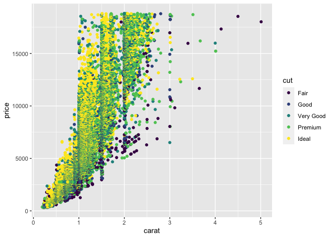
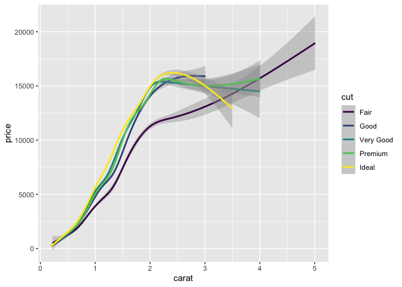
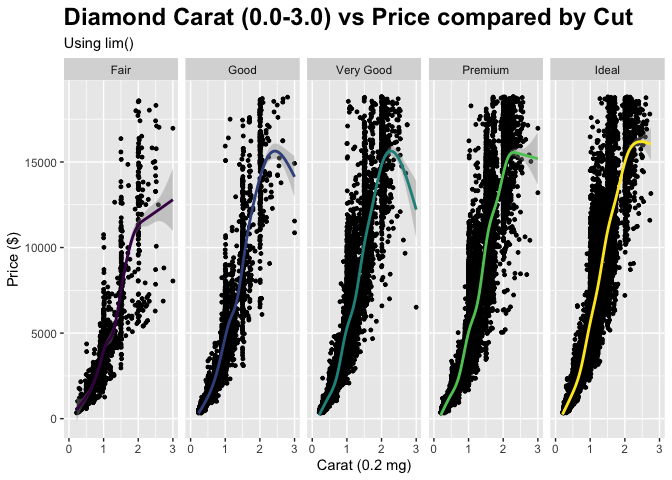

Getting Started: Diamonds
================
(Your name here)
2020-

  - [Grading Rubric](#grading-rubric)
      - [Individual](#individual)
      - [Team](#team)
      - [Due Date](#due-date)
  - [Data Exploration](#data-exploration)
  - [Communication](#communication)

*Purpose*: Throughout this course, you’ll complete a large number of
*exercises* and *challenges*. Exercises are meant to introduce content
with easy-to-solve problems, while challenges are meant to make you
think more deeply about and apply the content. The challenges will start
out highly-scaffolded, and become progressively open-ended.

In this challenge, you will go through the process of exploring,
documenting, and sharing an analysis of a dataset. We will use these
skills again and again in each challenge.

<!-- include-rubric -->

# Grading Rubric

<!-- -------------------------------------------------- -->

Unlike exercises, **challenges will be graded**. The following rubrics
define how you will be graded, both on an individual and team basis.

## Individual

<!-- ------------------------- -->

| Category    | Unsatisfactory                                                                   | Satisfactory                                                               |
| ----------- | -------------------------------------------------------------------------------- | -------------------------------------------------------------------------- |
| Effort      | Some task **q**’s left unattempted                                               | All task **q**’s attempted                                                 |
| Observed    | Did not document observations                                                    | Documented observations based on analysis                                  |
| Supported   | Some observations not supported by analysis                                      | All observations supported by analysis (table, graph, etc.)                |
| Code Styled | Violations of the [style guide](https://style.tidyverse.org/) hinder readability | Code sufficiently close to the [style guide](https://style.tidyverse.org/) |

## Team

<!-- ------------------------- -->

| Category   | Unsatisfactory                                                                                   | Satisfactory                                       |
| ---------- | ------------------------------------------------------------------------------------------------ | -------------------------------------------------- |
| Documented | No team contributions to Wiki                                                                    | Team contributed to Wiki                           |
| Referenced | No team references in Wiki                                                                       | At least one reference in Wiki to member report(s) |
| Relevant   | References unrelated to assertion, or difficult to find related analysis based on reference text | Reference text clearly points to relevant analysis |

## Due Date

<!-- ------------------------- -->

All the deliverables stated in the rubrics above are due on the day of
the class discussion of that exercise. See the
[Syllabus](https://docs.google.com/document/d/1jJTh2DH8nVJd2eyMMoyNGroReo0BKcJrz1eONi3rPSc/edit?usp=sharing)
for more information.

``` r
library(tidyverse)
```

    ## ── Attaching packages ─────────────────────────────────────── tidyverse 1.3.0 ──

    ## ✓ ggplot2 3.3.2     ✓ purrr   0.3.4
    ## ✓ tibble  3.0.1     ✓ dplyr   1.0.0
    ## ✓ tidyr   1.1.0     ✓ stringr 1.4.0
    ## ✓ readr   1.3.1     ✓ forcats 0.5.0

    ## ── Conflicts ────────────────────────────────────────── tidyverse_conflicts() ──
    ## x dplyr::filter() masks stats::filter()
    ## x dplyr::lag()    masks stats::lag()

# Data Exploration

<!-- -------------------------------------------------- -->

In this first stage, you will explore the `diamonds` dataset and
document your observations.

**q1** Create a plot of `price` vs `carat` of the `diamonds` dataset
below. Document your observations from the visual.

*Hint*: We learned how to do this in `e-vis00-basics`\!

``` r
## TASK: Plot `price` vs `carat` below
## Your code here!
ggplot(diamonds, aes(x = carat, y = price)) + geom_point()
```

<!-- -->

**Observations**:

Lowest carat diamonds (\<0.5) will not be prices at more than $5000,
while highest carat diamonds (\>3.0) can be priced between $7500 to over
$175000. There seems to be covariability between carat and price with
several outliers.

**q2** Create a visualization showing variables `carat`, `price`, and
`cut` simultaneously. Experiment with which variable you assign to which
aesthetic (`x`, `y`, etc.) to find an effective visual.

``` r
## TASK: Plot `price`, `carat`, and `cut` below
## Your code here!
plot_point <- diamonds %>% 
  ggplot(aes(x = carat, y = price, color = cut)) +
  geom_point()

plot_smooth <- diamonds %>% 
  ggplot(aes(x = carat, y = price, color = cut)) + 
  geom_smooth()

plot_combo <- diamonds %>% 
  ggplot(aes(x = carat, y = price)) +
  geom_point(color = "black", size = 1) +
  geom_smooth(aes(color = cut)) +
  xlim(0,3.0) +
  facet_grid(~ cut) +
  theme(legend.position = "none") +
  labs(
      title = "Diamond Carat (0.0-3.0) vs Price compared by Cut",
      subtitle = "A diamond must be either high cut quality or high carat to fetch a high price - if both, all the better!",
      x = "Carat (0.2 mg)", 
      y = "Price ($)"
      ) +
  theme(plot.title = element_text(size = 18, face = "bold"))

plot_point
```

<!-- -->

``` r
plot_smooth
```

    ## `geom_smooth()` using method = 'gam' and formula 'y ~ s(x, bs = "cs")'

<!-- -->

``` r
plot_combo
```

    ## `geom_smooth()` using method = 'gam' and formula 'y ~ s(x, bs = "cs")'

    ## Warning: Removed 32 rows containing non-finite values (stat_smooth).

    ## Warning: Removed 32 rows containing missing values (geom_point).

<!-- -->

**Observations**:

The point plot is overwhelming and takes several tries to understand.
After some time, I noticed that the better the cut, the more likely the
diamonds is to get away with a higher price despite lower carats.
Meanwhile diamonds that were only a lower cut happened to also be higher
carat if they fetched a higher price.

The smooth line plot is much less overwhelming to examine, though I
worry it implies a stronger relationship than I perceive. The trends
described with the point plots still apply but this plot reveals
something interesting about our data: for each cut, our data does not
span the same carats (though the data points for those with fewer data
points are diamonds with a carat above 3.0).

This made we wonder if I should overlay the point and smooth plot and
limit the x-axis (carats) to 0.0-3.0 and break the plot apart by cut. So
I did this and the relationship is between cut, carat, and price is made
all the more clear (aka the better the cut, the less the need to have a
high carat diamond to fetch a high price). It also demonstrated that we
may have more or less data per cut group - I wonder if this is a
function of desirability while attempting to sell.

# Communication

<!-- -------------------------------------------------- -->

In this next stage, you will render your data exploration, push it to
GitHub to share with others, and link your observations within our [Data
Science
Wiki](https://olin-data-science.fandom.com/wiki/Olin_Data_Science_Wiki).

**q3** *Knit* your document in order to create a report.

You can do this by clicking the “Knit” button at the top of your
document in RStudio.


This will create a local `.md` file, and RStudio will automatically open
a preview window so you can view your knitted document.

**q4** *Push* your knitted document to GitHub.


You will need to stage both the `.md` file, as well as the `_files`
folder. Note that the `_files` folder, when staged, will expand to
include all the files under that directory.


**q5** *Document* your findings in our
[Wiki](https://olin-data-science.fandom.com/wiki/Olin_Data_Science_Wiki).
Work with your learning team to come to consensus on your findings.

The [Datasets](https://olin-data-science.fandom.com/wiki/Datasets) page
contains lists all the datasets we’ve analyzed together.

**q6** *Prepare* to present your team’s findings\!

**q7** Add a link to your personal data-science repository on the
[Repositories](https://olin-data-science.fandom.com/wiki/Repositories)
page. Make sure to file it under your team name\!
