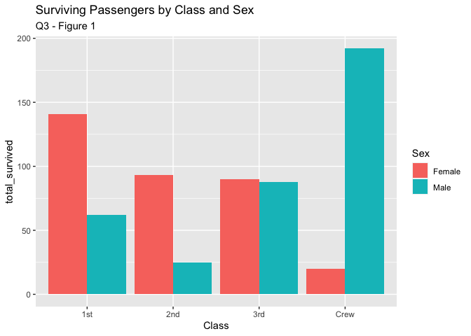
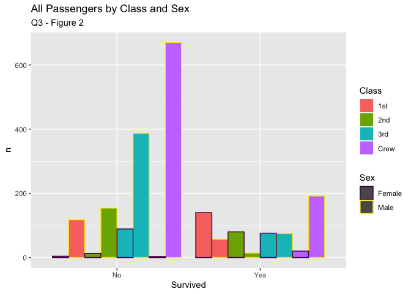
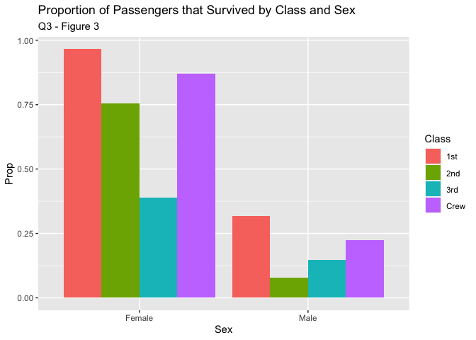

RMS Titanic
================
Ingrid Hagen-Keith
2020-07-16

  - [Grading Rubric](#grading-rubric)
      - [Individual](#individual)
      - [Team](#team)
      - [Due Date](#due-date)
  - [First Look](#first-look)
      - [Question 1](#question-1)
      - [Question 2](#question-2)
      - [Question 3](#question-3)
  - [Deeper Look](#deeper-look)
  - [Notes](#notes)

*Purpose*: Most datasets have at least a few variables. Part of our task
in analyzing a dataset is to understand trends as they vary across these
different variables. Unless we’re careful and thorough, we can easily
miss these patterns. In this challenge you’ll analyze a dataset with a
small number of categorical variables and try to find differences among
the groups.

*Reading*: (Optional) [Wikipedia
article](https://en.wikipedia.org/wiki/RMS_Titanic) on the RMS Titanic.

<!-- include-rubric -->

# Grading Rubric

<!-- -------------------------------------------------- -->

Unlike exercises, **challenges will be graded**. The following rubrics
define how you will be graded, both on an individual and team basis.

## Individual

<!-- ------------------------- -->

| Category    | Unsatisfactory                                                                   | Satisfactory                                                               |
| ----------- | -------------------------------------------------------------------------------- | -------------------------------------------------------------------------- |
| Effort      | Some task **q**’s left unattempted                                               | All task **q**’s attempted                                                 |
| Observed    | Did not document observations                                                    | Documented observations based on analysis                                  |
| Supported   | Some observations not supported by analysis                                      | All observations supported by analysis (table, graph, etc.)                |
| Code Styled | Violations of the [style guide](https://style.tidyverse.org/) hinder readability | Code sufficiently close to the [style guide](https://style.tidyverse.org/) |

## Team

<!-- ------------------------- -->

| Category   | Unsatisfactory                                                                                   | Satisfactory                                       |
| ---------- | ------------------------------------------------------------------------------------------------ | -------------------------------------------------- |
| Documented | No team contributions to Wiki                                                                    | Team contributed to Wiki                           |
| Referenced | No team references in Wiki                                                                       | At least one reference in Wiki to member report(s) |
| Relevant   | References unrelated to assertion, or difficult to find related analysis based on reference text | Reference text clearly points to relevant analysis |

## Due Date

<!-- ------------------------- -->

All the deliverables stated in the rubrics above are due on the day of
the class discussion of that exercise. See the
[Syllabus](https://docs.google.com/document/d/1jJTh2DH8nVJd2eyMMoyNGroReo0BKcJrz1eONi3rPSc/edit?usp=sharing)
for more information.

``` r
library(tidyverse)
```

    ## ── Attaching packages ──────────────────────────────────────────────────────────────────── tidyverse 1.3.0 ──

    ## ✓ ggplot2 3.3.2     ✓ purrr   0.3.4
    ## ✓ tibble  3.0.1     ✓ dplyr   1.0.0
    ## ✓ tidyr   1.1.0     ✓ stringr 1.4.0
    ## ✓ readr   1.3.1     ✓ forcats 0.5.0

    ## ── Conflicts ─────────────────────────────────────────────────────────────────────── tidyverse_conflicts() ──
    ## x dplyr::filter() masks stats::filter()
    ## x dplyr::lag()    masks stats::lag()

``` r
df_titanic <- as_tibble(Titanic)
```

*Background*: The RMS Titanic sank on its maiden voyage in 1912; about
67% of its passengers died.

# First Look

<!-- -------------------------------------------------- -->

## Question 1

**q1** Perform a glimpse of `df_titanic`. What variables are in this
dataset?

``` r
## TASK: Perform a `glimpse` of df_titanic
glimpse(df_titanic)
```

    ## Rows: 32
    ## Columns: 5
    ## $ Class    <chr> "1st", "2nd", "3rd", "Crew", "1st", "2nd", "3rd", "Crew", "1…
    ## $ Sex      <chr> "Male", "Male", "Male", "Male", "Female", "Female", "Female"…
    ## $ Age      <chr> "Child", "Child", "Child", "Child", "Child", "Child", "Child…
    ## $ Survived <chr> "No", "No", "No", "No", "No", "No", "No", "No", "No", "No", …
    ## $ n        <dbl> 0, 0, 35, 0, 0, 0, 17, 0, 118, 154, 387, 670, 4, 13, 89, 3, …

***Observations***:

**The data frame includes the following variables:**

  - **Class (categorical)**
  - **Sex (categorical)**
  - **Age (categorical)**
  - **Survived (categorical)**
  - **n (continuous) aka the number of poeple for each category**

## Question 2

**q2** Skim the [Wikipedia
article](https://en.wikipedia.org/wiki/RMS_Titanic) on the RMS Titanic,
and look for a total count of passengers. Compare against the total
computed below. Are there any differences? Are those differences large
or small? What might account for those differences?

``` r
## NOTE: No need to edit! We'll cover how to
## do this calculation in a later exercise.
df_titanic %>% summarize(total = sum(n))
```

    ## # A tibble: 1 x 1
    ##   total
    ##   <dbl>
    ## 1  2201

***Observations***:

  - **The [Titanic Wikipedia
    article](https://en.wikipedia.org/wiki/RMS_Titanic) notes that**:

> “passengers numbered approximately 1,317 people: 324 in First Class,
> 284 in Second Class, and 709 in Third Class. Of these, 869 (66%) were
> male and 447 (34%) female. There were 107 children aboard, the largest
> number of whom were in Third Class.”

  - **Our data frame indicates that 2201 people were onboard the
    Titanic. This may be because the crew are included in the data
    frame. The article also includes that:**

> “Titanic had around 885 crew members on board for her maiden voyage.”

  - **When adding these two numbers, we find that the total 2202 is one
    person more than the total calculated in our data frame. In a
    different [Wikipedia article regarding seafarer
    ranks](https://en.wikipedia.org/wiki/Seafarer%27s_professions_and_ranks#:~:text=The%20captain%20represents%20the%20owner,to%20be%20a%20crew%20member.),
    I may have found the answer regarding the discrepancy of one person:
    technically the captain is not considered a crew member yet a
    [Titanic Wikipedia article about the
    crew](https://en.wikipedia.org/wiki/Crew_of_the_RMS_Titanic)
    includes the captain in the crew member list even though this is not
    technically correct.**

> “The captain represents the owner and hence is called”master“. The
> captain is officially not considered to be a crew member.”

## Question 3

**q3** Create a plot showing the count of passengers who *did* survive,
along with aesthetics for `Class` and `Sex`. Document your observations
below.

*Note*: There are many ways to do this.

``` r
## TASK: Visualize counts against `Class` and `Sex`

df_q3_v1 <- df_titanic %>%
  filter(Survived == "Yes") %>% 
  group_by(Class, Sex) %>% 
  summarise(total_survived = sum(n))
```

    ## `summarise()` regrouping output by 'Class' (override with `.groups` argument)

``` r
df_q3_v1
```

    ## # A tibble: 8 x 3
    ## # Groups:   Class [4]
    ##   Class Sex    total_survived
    ##   <chr> <chr>           <dbl>
    ## 1 1st   Female            141
    ## 2 1st   Male               62
    ## 3 2nd   Female             93
    ## 4 2nd   Male               25
    ## 5 3rd   Female             90
    ## 6 3rd   Male               88
    ## 7 Crew  Female             20
    ## 8 Crew  Male              192

``` r
plot_col <- df_q3_v1 %>% 
  ggplot() +
  geom_col(aes(x = Class, y = total_survived, fill = Sex), position = "dodge") +
  labs(title = "Surviving Passengers by Class and Sex", subtitle = "Q3 - Figure 1")

plot_col
```

<!-- -->

**I first tried to filter the data. This answers the question but does
not fulfill the prompt to use aesthetics to create the plot. I also
noted that while this helps understand survivorship between groups, it
does not put these numbers into context of the relative size of each
group. So I tried again.**

``` r
## TASK: Visualize counts against `Class` and `Sex`

plot_col2 <- df_titanic %>% 
  ggplot() +
  geom_col(aes(x = Survived , y = n, fill = Class, color = Sex), position = "dodge") +
  scale_colour_viridis_d() +
  labs(title = "All Passengers by Class and Sex", subtitle = "Q3 - Figure 2")

plot_col2
```

<!-- -->

**This time, I wanted to include all data for Class, Sex, and Survived
to get an idea of the proportion of survivors. I also wanted to follow
the prompt by using aesthetics to represent Class and Sex.**

**But this plot was super overwhelming. I did not like it at all.**

``` r
## TASK: Visualize counts against `Class` and `Sex`

df_q3_v2 <- df_titanic %>% 
  group_by(Class, Sex) %>% 
  mutate( Total = sum(n), Prop = n / Total) %>% 
  filter(Survived == "Yes")

plot_col3 <- df_q3_v2 %>% 
  ggplot() +
  geom_col(aes(x = Sex, y = Prop, fill = Class), width = 0.9, position = "dodge") +
  labs(title = "Proportion of Passengers that Survived by Class and Sex", subtitle = "Q3 - Figure 3")

plot_col3
```

<!-- -->

**This time, I calculated the proportion of survivors within the Class
and Sex group. I also combined what I had learned from the two previous
plots.**

***Overall Observations:***

  - **Based on Q3 - Figure 2**
      - **Because passengers are broken down by class and sex, the crew
        looks huge\! They were mainly men and few survived.**
  - **Based on Q3 - Figure 3**
      - **Women were more likely to survive than men - I remember that
        from the movie :)**
      - **For women, your likelihood of surviving is related to class
        (1st more likely than crew, which is more likely than 2nd class,
        which is more likely than 3rd). For men, there is an interesting
        pattern - 1st is more likely than crew, which is more likely
        than *3rd* which is more likely than 2nd. Why could this be?**
      - **The proportion of women in 1st class who survived is almsot
        three times that of men in 1st class, and ten times of that of
        men in 2nd class.**

# Deeper Look

<!-- -------------------------------------------------- -->

Raw counts give us a sense of totals, but they are not as useful for
understanding differences between groups. This is because the
differences we see in counts could be due to either the relative size of
the group OR differences in outcomes for those groups. To make
comparisons between groups, we should also consider *proportions*.\[1\]

The following code computes proportions within each `Class, Sex, Age`
group.

``` r
## NOTE: No need to edit! We'll cover how to
## do this calculation in a later exercise.
df_prop <-
  df_titanic %>%
  group_by(Class, Sex, Age) %>%
  mutate(
    Total = sum(n),
    Prop = n / Total
  ) %>%
  ungroup()
df_prop
```

    ## # A tibble: 32 x 7
    ##    Class Sex    Age   Survived     n Total    Prop
    ##    <chr> <chr>  <chr> <chr>    <dbl> <dbl>   <dbl>
    ##  1 1st   Male   Child No           0     5   0    
    ##  2 2nd   Male   Child No           0    11   0    
    ##  3 3rd   Male   Child No          35    48   0.729
    ##  4 Crew  Male   Child No           0     0 NaN    
    ##  5 1st   Female Child No           0     1   0    
    ##  6 2nd   Female Child No           0    13   0    
    ##  7 3rd   Female Child No          17    31   0.548
    ##  8 Crew  Female Child No           0     0 NaN    
    ##  9 1st   Male   Adult No         118   175   0.674
    ## 10 2nd   Male   Adult No         154   168   0.917
    ## # … with 22 more rows

**q4** Replicate your visual from q3, but display `Prop` in place of
`n`. Document your observations, and note any new/different observations
you make in comparison with q3.

**Observations**:

  - Write your observations here.

**q5** Create a plot showing the group-proportion of passengers who
*did* survive, along with aesthetics for `Class`, `Sex`, *and* `Age`.
Document your observations below.

*Hint*: Don’t forget that you can use `facet_grid` to help consider
additional variables\!

**Observations**:

  - Write your observations here.

# Notes

<!-- -------------------------------------------------- -->

\[1\] This is basically the same idea as [Dimensional
Analysis](https://en.wikipedia.org/wiki/Dimensional_analysis); computing
proportions is akin to non-dimensionalizing a quantity.
