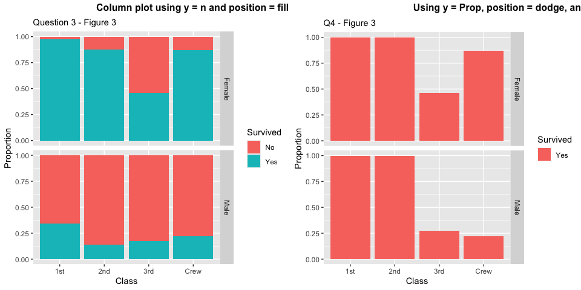

RMS Titanic
================
Ingrid Hagen-Keith
2020-07-16

  - [Grading Rubric](#grading-rubric)
      - [Individual](#individual)
      - [Team](#team)
      - [Due Date](#due-date)
  - [First Look](#first-look)
      - [Question 1](#question-1)
      - [Question 2](#question-2)
      - [Question 3](#question-3)
  - [Deeper Look](#deeper-look)
      - [Question 4](#question-4)
      - [Question 5](#question-5)
  - [Notes](#notes)

*Purpose*: Most datasets have at least a few variables. Part of our task
in analyzing a dataset is to understand trends as they vary across these
different variables. Unless we’re careful and thorough, we can easily
miss these patterns. In this challenge you’ll analyze a dataset with a
small number of categorical variables and try to find differences among
the groups.

*Reading*: (Optional) [Wikipedia
article](https://en.wikipedia.org/wiki/RMS_Titanic) on the RMS Titanic.

<!-- include-rubric -->

# Grading Rubric

<!-- -------------------------------------------------- -->

Unlike exercises, **challenges will be graded**. The following rubrics
define how you will be graded, both on an individual and team basis.

## Individual

<!-- ------------------------- -->

| Category    | Unsatisfactory                                                                   | Satisfactory                                                               |
| ----------- | -------------------------------------------------------------------------------- | -------------------------------------------------------------------------- |
| Effort      | Some task **q**’s left unattempted                                               | All task **q**’s attempted                                                 |
| Observed    | Did not document observations                                                    | Documented observations based on analysis                                  |
| Supported   | Some observations not supported by analysis                                      | All observations supported by analysis (table, graph, etc.)                |
| Code Styled | Violations of the [style guide](https://style.tidyverse.org/) hinder readability | Code sufficiently close to the [style guide](https://style.tidyverse.org/) |

## Team

<!-- ------------------------- -->

| Category   | Unsatisfactory                                                                                   | Satisfactory                                       |
| ---------- | ------------------------------------------------------------------------------------------------ | -------------------------------------------------- |
| Documented | No team contributions to Wiki                                                                    | Team contributed to Wiki                           |
| Referenced | No team references in Wiki                                                                       | At least one reference in Wiki to member report(s) |
| Relevant   | References unrelated to assertion, or difficult to find related analysis based on reference text | Reference text clearly points to relevant analysis |

## Due Date

<!-- ------------------------- -->

All the deliverables stated in the rubrics above are due on the day of
the class discussion of that exercise. See the
[Syllabus](https://docs.google.com/document/d/1jJTh2DH8nVJd2eyMMoyNGroReo0BKcJrz1eONi3rPSc/edit?usp=sharing)
for more information.

``` r
library(tidyverse)
```

    ## ── Attaching packages ────────────────────────────────────────────────────────── tidyverse 1.3.0 ──

    ## ✓ ggplot2 3.3.2     ✓ purrr   0.3.4
    ## ✓ tibble  3.0.1     ✓ dplyr   1.0.0
    ## ✓ tidyr   1.1.0     ✓ stringr 1.4.0
    ## ✓ readr   1.3.1     ✓ forcats 0.5.0

    ## ── Conflicts ───────────────────────────────────────────────────────────── tidyverse_conflicts() ──
    ## x dplyr::filter() masks stats::filter()
    ## x dplyr::lag()    masks stats::lag()

``` r
library(cowplot)
```

    ## 
    ## ********************************************************

    ## Note: As of version 1.0.0, cowplot does not change the

    ##   default ggplot2 theme anymore. To recover the previous

    ##   behavior, execute:
    ##   theme_set(theme_cowplot())

    ## ********************************************************

``` r
df_titanic <- as_tibble(Titanic)
```

*Background*: The RMS Titanic sank on its maiden voyage in 1912; about
67% of its passengers died.

# First Look

<!-- -------------------------------------------------- -->

## Question 1

**q1** Perform a glimpse of `df_titanic`. What variables are in this
dataset?

``` r
## TASK: Perform a `glimpse` of df_titanic
glimpse(df_titanic)
```

    ## Rows: 32
    ## Columns: 5
    ## $ Class    <chr> "1st", "2nd", "3rd", "Crew", "1st", "2nd", "3rd", "Crew", "1…
    ## $ Sex      <chr> "Male", "Male", "Male", "Male", "Female", "Female", "Female"…
    ## $ Age      <chr> "Child", "Child", "Child", "Child", "Child", "Child", "Child…
    ## $ Survived <chr> "No", "No", "No", "No", "No", "No", "No", "No", "No", "No", …
    ## $ n        <dbl> 0, 0, 35, 0, 0, 0, 17, 0, 118, 154, 387, 670, 4, 13, 89, 3, …

***Observations***:

**The data frame includes the following variables:**

  - **Class (categorical)**
  - **Sex (categorical)**
  - **Age (categorical)**
  - **Survived (categorical)**
  - **n (continuous) aka the number of poeple for each category**

## Question 2

**q2** Skim the [Wikipedia
article](https://en.wikipedia.org/wiki/RMS_Titanic) on the RMS Titanic,
and look for a total count of passengers. Compare against the total
computed below. Are there any differences? Are those differences large
or small? What might account for those differences?

``` r
## NOTE: No need to edit! We'll cover how to
## do this calculation in a later exercise.
v1 <- df_titanic %>% summarize(total = sum(n))

v2 <- df_titanic %>% group_by(Class) %>% summarize(sum(n))
```

    ## `summarise()` ungrouping output (override with `.groups` argument)

``` r
v2
```

    ## # A tibble: 4 x 2
    ##   Class `sum(n)`
    ##   <chr>    <dbl>
    ## 1 1st        325
    ## 2 2nd        285
    ## 3 3rd        706
    ## 4 Crew       885

***Observations***:

  - **The [Titanic Wikipedia
    article](https://en.wikipedia.org/wiki/RMS_Titanic#Passengers) notes
    that**:

> “passengers numbered approximately 1,317 people: 324 in First Class,
> 284 in Second Class, and 709 in Third Class. Of these, 869 (66%) were
> male and 447 (34%) female. There were 107 children aboard, the largest
> number of whom were in Third Class.”

  - **Our data frame indicates that 2201 people were onboard the
    Titanic. This may be because the crew are included in the data
    frame. The article also includes that:**

> “Titanic had around 885 crew members on board for her maiden voyage.”

  - **When adding these two numbers, we find that the total 2202 is one
    person more than the total calculated in our data frame. In a
    different [Wikipedia article regarding seafarer
    ranks](https://en.wikipedia.org/wiki/Seafarer%27s_professions_and_ranks#:~:text=The%20captain%20represents%20the%20owner,to%20be%20a%20crew%20member.),
    I may have found the answer regarding the discrepancy of one person:
    technically the captain is not considered a crew member yet a
    [Titanic Wikipedia article about the
    crew](https://en.wikipedia.org/wiki/Crew_of_the_RMS_Titanic)
    includes the captain in the crew member list even though this is not
    technically correct.**

> “The captain represents the owner and hence is called”master“. The
> captain is officially not considered to be a crew member.”

## Question 3

**q3** Create a plot showing the count of passengers who *did* survive,
along with aesthetics for `Class` and `Sex`. Document your observations
below.

*Note*: There are many ways to do this.

``` r
## TASK: Visualize counts against `Class` and `Sex`

df_q3_v1 <- df_titanic %>%
  filter(Survived == "Yes") %>% 
  group_by(Class, Sex) %>% 
  summarise(total_survived = sum(n))

plot_col_q3_v1 <- df_q3_v1 %>% 
  ggplot() +
  geom_col(aes(x = Class, y = total_survived, fill = Sex), position = "dodge") +
  labs(title = "Surviving Passengers by Class and Sex", subtitle = "Q3 - Figure 1") +
  theme(plot.title = element_text(size = 14, face = "bold"))

plot_col_q3_v2 <- df_titanic %>% 
  ggplot() +
  geom_col(aes(x = Class , y = n, fill = Survived), position = "dodge") +
  scale_colour_viridis_d() +
  facet_grid(Sex~.) +
  labs(
      title = "All Passengers by Class and Sex", 
      subtitle = "Q3 - Figure 2",
      x = "Class", 
      y = "Count"
      ) +
  theme(plot.title = element_text(size = 14, face = "bold"))

plot_col_q3_v3 <- df_titanic %>% 
  ggplot() +
  geom_col(aes(x = Class , y = n, fill = Survived), position = "fill") +
  scale_colour_viridis_d() +
  facet_grid(Sex~.) +
  labs(
      title = "Proportions of Passengers by Survivorship, Class and Sex", 
      subtitle = "Q3 - Figure 3",
      x = "Class", 
      y = "Proportion"
      ) +
  theme(plot.title = element_text(size = 14, face = "bold"))
```

``` r
## TASK: Visualize counts against `Class` and `Sex`

plot_col_q3_v1
```

<!-- -->

``` r
plot_col_q3_v2
```

<!-- -->

``` r
plot_col_q3_v3
```

<!-- -->

***Plot Creation Process***

**Figure 1. I first tried to filter the data. I noted that while this
helps understand survivorship between groups, it does not put these
numbers into context of the relative size of each group. So I tried
again.**

**Figure 2. This time, I didn’t filter because I wanted to know about
the relative frequency of survivorship across Class and Sex. That being
said, it’s so much information (too many bars) so I tried again.**

**Figure 3. Finally, I used the position = “fill” so get the relative
likelihood of surviving based on the Class and Sex.**

***Overall Observations:***

  - **Based on Q3 - Figure 2**
      - **There were far more men aboard than women.**
      - **Women were more likely to survive than men - I remember that
        from the movie :)**
      - **For women, your likelihood of surviving is related to class
        (1st more likely than crew, which is more likely than 2nd class,
        which is more likely than 3rd).**
      - **The proportion of women in 1st class who survived is almost
        three times that of men in 1st class, and ten times of that of
        men in 2nd class.**
      - **3rd class is the only class where more women died than
        survived.**
  - **Based on Q3 - Figure 3**
      - **For men, there is an interesting pattern - 1st is more likely
        than crew, which is more likely than *3rd* which is more likely
        than 2nd. Why could this be? It is answered in Question 5\!**

# Deeper Look

<!-- -------------------------------------------------- -->

Raw counts give us a sense of totals, but they are not as useful for
understanding differences between groups. This is because the
differences we see in counts could be due to either the relative size of
the group OR differences in outcomes for those groups. To make
comparisons between groups, we should also consider *proportions*.\[1\]

The following code computes proportions within each `Class, Sex, Age`
group.

``` r
## NOTE: No need to edit! We'll cover how to
## do this calculation in a later exercise.
df_prop <-
  df_titanic %>%
  group_by(Class, Sex, Age) %>%
  mutate(
    Total = sum(n),
    Prop = n / Total
  ) %>%
  ungroup()
df_prop
```

    ## # A tibble: 32 x 7
    ##    Class Sex    Age   Survived     n Total    Prop
    ##    <chr> <chr>  <chr> <chr>    <dbl> <dbl>   <dbl>
    ##  1 1st   Male   Child No           0     5   0    
    ##  2 2nd   Male   Child No           0    11   0    
    ##  3 3rd   Male   Child No          35    48   0.729
    ##  4 Crew  Male   Child No           0     0 NaN    
    ##  5 1st   Female Child No           0     1   0    
    ##  6 2nd   Female Child No           0    13   0    
    ##  7 3rd   Female Child No          17    31   0.548
    ##  8 Crew  Female Child No           0     0 NaN    
    ##  9 1st   Male   Adult No         118   175   0.674
    ## 10 2nd   Male   Adult No         154   168   0.917
    ## # … with 22 more rows

## Question 4

**q4** Replicate your visual from q3, but display `Prop` in place of
`n`. Document your observations, and note any new/different observations
you make in comparison with q3.

``` r
plot_col_q3_v3 <- df_titanic %>% 
  ggplot() +
  geom_col(aes(x = Class , y = n, fill = Survived), position = "fill") +
  scale_colour_viridis_d() +
  facet_grid(Sex~.) +
  labs(
      title = " ",
      subtitle = "Question 3 - Figure 3",
      x = "Class", 
      y = "Proportion"
      )

plot_col_q4_fill <- df_prop %>% 
  ggplot() +
  geom_col(aes(x = Class , y = Prop, fill = Survived), position = "fill") +
  scale_colour_viridis_d() +
  facet_grid(Sex~.) +
  labs(
      title = " ",
      subtitle = "Q4 - Figure 1",
      x = "Class", 
      y = "Proportion"
      ) +
  theme(plot.title = element_text(size = 14, face = "bold"))

plot_col_q4_dodge <- df_prop %>% 
  ggplot() +
  geom_col(aes(x = Class , y = Prop, fill = Survived), position = "dodge") +
  scale_colour_viridis_d() +
  facet_grid(Sex~.) +
  labs(
      title = " ",
      subtitle = "Q4 - Figure 2",
      x = "Class",
      y = "Proportion"
      ) +
  theme(plot.title = element_text(size = 14, face = "bold"))
```

``` r
plot_grid(
  plot_col_q3_v3, 
  plot_col_q4_fill, 
  labels = c('Using y = n and position = fill', 'Using y = Prop and position = fill'), 
  label_size = 12)
```

<!-- -->

***Observations***:

  - **They don’t look the same\! Please reference the Men’s subplot\!
    Very curious.**
  - **So I made another plot to compare if it is because of position of
    my plots.**
  - **I currently trust the fill plot more than the proportion plot.**

<!-- end list -->

``` r
plot_grid(
  plot_col_q3_v3, 
  plot_col_q4_dodge, 
  labels = c('Using y = n and position = fill', 'Using y = Prop and position = dodge'), 
  label_size = 12)
```

<!-- -->

  - **I truly cannot figure out why is it this way. I’m wondering if my
    understanding of Prop. I would expect that each class per sex would
    sum to 1.0 Nothing is matching up\!**
  - **But I need to remember how these column plots work. When grouping
    and using position = dodge, the columns are the sums of the values
    where the sub-groupings (survived, class, sex) are true.**
  - **So I’ll just compare the proportions where Survived = “Yes”?**

<!-- end list -->

``` r
plot_col_q4_survived <- df_prop %>%
  filter(Survived == "Yes") %>% 
  ggplot() +
  geom_col(
    aes(
      x = Class , 
      y = Prop, 
      fill = Survived
      ), 
    position = "dodge"
    ) +
  scale_colour_viridis_d() +
  facet_grid(Sex~.) +
  labs(
      title = " ",
      subtitle = "Q4 - Figure 3",
      x = "Class",
      y = "Proportion"
      ) +
  theme(plot.title = element_text(size = 14, face = "bold"))

plot_grid(
  plot_col_q3_v3,
  plot_col_q4_survived,
  labels = c('Column plot using y = n and position = fill', 'Using y = Prop, position = dodge, and Survived = Yes'),
  label_size = 12)
```

    ## Warning: Removed 2 rows containing missing values (geom_col).

<!-- -->

  - **Things are still not making sense. I think it may have to do with
    how the data is grouped. So finally, I’m going to try calculating
    the data myself but this time filtering only for those who
    survived.**

<!-- end list -->

``` r
## NOTE: No need to edit! We'll cover how to
## do this calculation in a later exercise.
df_prop2 <-
  df_titanic %>%
  group_by(Class, Sex) %>%
  mutate(
    Total = sum(n),
    Prop = n / Total
  ) %>%
  filter(Survived == "Yes") #%>% 
  #ungroup()

  df_prop2
```

    ## # A tibble: 16 x 7
    ## # Groups:   Class, Sex [8]
    ##    Class Sex    Age   Survived     n Total    Prop
    ##    <chr> <chr>  <chr> <chr>    <dbl> <dbl>   <dbl>
    ##  1 1st   Male   Child Yes          5   180 0.0278 
    ##  2 2nd   Male   Child Yes         11   179 0.0615 
    ##  3 3rd   Male   Child Yes         13   510 0.0255 
    ##  4 Crew  Male   Child Yes          0   862 0      
    ##  5 1st   Female Child Yes          1   145 0.00690
    ##  6 2nd   Female Child Yes         13   106 0.123  
    ##  7 3rd   Female Child Yes         14   196 0.0714 
    ##  8 Crew  Female Child Yes          0    23 0      
    ##  9 1st   Male   Adult Yes         57   180 0.317  
    ## 10 2nd   Male   Adult Yes         14   179 0.0782 
    ## 11 3rd   Male   Adult Yes         75   510 0.147  
    ## 12 Crew  Male   Adult Yes        192   862 0.223  
    ## 13 1st   Female Adult Yes        140   145 0.966  
    ## 14 2nd   Female Adult Yes         80   106 0.755  
    ## 15 3rd   Female Adult Yes         76   196 0.388  
    ## 16 Crew  Female Adult Yes         20    23 0.870

``` r
plot_col_q4_survived_p2 <- df_prop2 %>%
  ggplot() +
  geom_col(
    aes(
      x = Class , 
      y = Prop, 
      fill = Survived
      ), 
    position = "dodge"
    ) +
  scale_colour_viridis_d() +
  facet_grid(Sex~.) +
  labs(
      title = " ",
      subtitle = "Q4 - Figure 4",
      x = "Class",
      y = "Proportion"
      ) +
  theme(plot.title = element_text(size = 14, face = "bold"))

plot_grid(
  plot_col_q3_v3,
  plot_col_q4_survived_p2,
  labels = c('Column plot using y = n and position = fill', 'Using y = Prop, position = dodge, and Survived = Yes'),
  label_size = 8)
```

<!-- -->

  - **Ok the proportions are closer but still not exactly the same. I’m
    officially out of time to dig into this so I’ll need to ask Zach
    about it :) I guess I tried.**

## Question 5

**q5** Create a plot showing the group-proportion of passengers who
*did* survive, along with aesthetics for `Class`, `Sex`, *and* `Age`.
Document your observations below.

*Hint*: Don’t forget that you can use `facet_grid` to help consider
additional variables\!

``` r
plot_col_q5 <- 
  df_prop %>% 
  filter(Survived == "Yes") %>% 
  ggplot() +
  geom_col(aes(x = Class, y = Prop, fill = Sex), width = 0.9, position = "dodge") +
  facet_grid(Age~.) +
  labs(
      title = "Proportion of Passengers that Survived by Class, Sex, and Age", 
      subtitle = "Q5 - Figure 1",
      x = "Class", 
      y = "Proportion"
      ) +
  theme(plot.title = element_text(size = 14, face = "bold"))


plot_col_q5
```

<!-- -->

***Observations***:

  - **All children in 1st and 2nd Class survived. 55% of female children
    survived while almost 75% of male children survived. There were no
    children in the crew.**

# Notes

<!-- -------------------------------------------------- -->

\[1\] This is basically the same idea as [Dimensional
Analysis](https://en.wikipedia.org/wiki/Dimensional_analysis); computing
proportions is akin to non-dimensionalizing a quantity.
