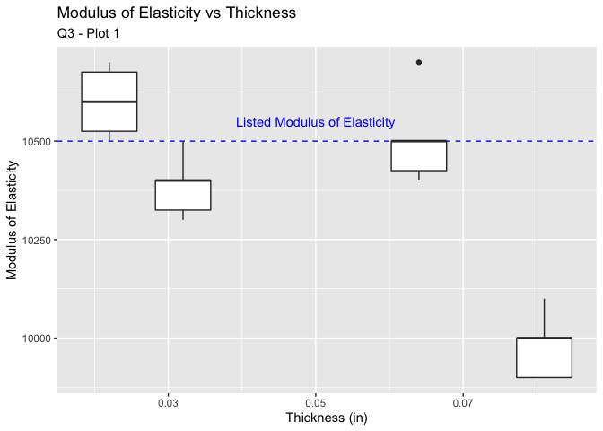
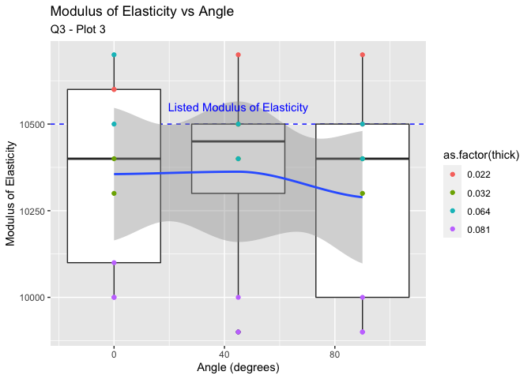

Aluminum Data
================
ingridmathilde
2020-07-18

  - [Grading Rubric](#grading-rubric)
      - [Individual](#individual)
      - [Team](#team)
      - [Due Date](#due-date)
  - [Loading and Wrangle](#loading-and-wrangle)
      - [Question 1](#question-1)
  - [EDA](#eda)
      - [Initial checks](#initial-checks)
          - [Question 2](#question-2)
  - [Visualize](#visualize)
      - [Question 3](#question-3)
      - [Question 4](#question-4)
  - [References](#references)

*Purpose*: When designing structures such as bridges, boats, and planes,
the design team needs data about *material properties*. Often when we
engineers first learn about material properties through coursework, we
talk about abstract ideas and look up values in tables without ever
looking at the data that gave rise to published properties. In this
challenge you’ll study an aluminum alloy dataset: Studying these data
will give you a better sense of the challenges underlying published
material values.

In this challenge, you will load a real dataset, wrangle it into tidy
form, and perform EDA to learn more about the data.

<!-- include-rubric -->

# Grading Rubric

<!-- -------------------------------------------------- -->

Unlike exercises, **challenges will be graded**. The following rubrics
define how you will be graded, both on an individual and team basis.

## Individual

<!-- ------------------------- -->

| Category    | Unsatisfactory                                                                   | Satisfactory                                                               |
| ----------- | -------------------------------------------------------------------------------- | -------------------------------------------------------------------------- |
| Effort      | Some task **q**’s left unattempted                                               | All task **q**’s attempted                                                 |
| Observed    | Did not document observations                                                    | Documented observations based on analysis                                  |
| Supported   | Some observations not supported by analysis                                      | All observations supported by analysis (table, graph, etc.)                |
| Code Styled | Violations of the [style guide](https://style.tidyverse.org/) hinder readability | Code sufficiently close to the [style guide](https://style.tidyverse.org/) |

## Team

<!-- ------------------------- -->

| Category   | Unsatisfactory                                                                                   | Satisfactory                                       |
| ---------- | ------------------------------------------------------------------------------------------------ | -------------------------------------------------- |
| Documented | No team contributions to Wiki                                                                    | Team contributed to Wiki                           |
| Referenced | No team references in Wiki                                                                       | At least one reference in Wiki to member report(s) |
| Relevant   | References unrelated to assertion, or difficult to find related analysis based on reference text | Reference text clearly points to relevant analysis |

## Due Date

<!-- ------------------------- -->

All the deliverables stated in the rubrics above are due on the day of
the class discussion of that exercise. See the
[Syllabus](https://docs.google.com/document/d/1jJTh2DH8nVJd2eyMMoyNGroReo0BKcJrz1eONi3rPSc/edit?usp=sharing)
for more information.

``` r
library(tidyverse)
```

    ## ── Attaching packages ────────────────────────────────────────────────────────── tidyverse 1.3.0 ──

    ## ✓ ggplot2 3.3.2     ✓ purrr   0.3.4
    ## ✓ tibble  3.0.1     ✓ dplyr   1.0.0
    ## ✓ tidyr   1.1.0     ✓ stringr 1.4.0
    ## ✓ readr   1.3.1     ✓ forcats 0.5.0

    ## ── Conflicts ───────────────────────────────────────────────────────────── tidyverse_conflicts() ──
    ## x dplyr::filter() masks stats::filter()
    ## x dplyr::lag()    masks stats::lag()

*Background*: In 1946, scientists at the Bureau of Standards tested a
number of Aluminum plates to determine their
[elasticity](https://en.wikipedia.org/wiki/Elastic_modulus) and
[Poisson’s ratio](https://en.wikipedia.org/wiki/Poisson%27s_ratio).
These are key quantities used in the design of structural members, such
as aircraft skin under [buckling
loads](https://en.wikipedia.org/wiki/Buckling). These scientists tested
plats of various thicknesses, and at different angles with respect to
the [rolling](https://en.wikipedia.org/wiki/Rolling_\(metalworking\))
direction.

# Loading and Wrangle

<!-- -------------------------------------------------- -->

The `readr` package in the Tidyverse contains functions to load data
form many sources. The `read_csv()` function will help us load the data
for this challenge.

``` r
## NOTE: If you extracted all challenges to the same location,
## you shouldn't have to change this filename
filename <- "./data/stang.csv"

## Load the data
df_stang <- read_csv(filename)
```

    ## Parsed with column specification:
    ## cols(
    ##   thick = col_double(),
    ##   E_00 = col_double(),
    ##   mu_00 = col_double(),
    ##   E_45 = col_double(),
    ##   mu_45 = col_double(),
    ##   E_90 = col_double(),
    ##   mu_90 = col_double(),
    ##   alloy = col_character()
    ## )

``` r
df_stang
```

    ## # A tibble: 9 x 8
    ##   thick  E_00 mu_00  E_45  mu_45  E_90 mu_90 alloy  
    ##   <dbl> <dbl> <dbl> <dbl>  <dbl> <dbl> <dbl> <chr>  
    ## 1 0.022 10600 0.321 10700  0.329 10500 0.31  al_24st
    ## 2 0.022 10600 0.323 10500  0.331 10700 0.323 al_24st
    ## 3 0.032 10400 0.329 10400  0.318 10300 0.322 al_24st
    ## 4 0.032 10300 0.319 10500  0.326 10400 0.33  al_24st
    ## 5 0.064 10500 0.323 10400  0.331 10400 0.327 al_24st
    ## 6 0.064 10700 0.328 10500  0.328 10500 0.32  al_24st
    ## 7 0.081 10000 0.315 10000  0.32   9900 0.314 al_24st
    ## 8 0.081 10100 0.312  9900  0.312 10000 0.316 al_24st
    ## 9 0.081 10000 0.311    -1 -1      9900 0.314 al_24st

Note that these data are not tidy\! The data in this form are convenient
for reporting in a table, but are not ideal for analysis.

## Question 1

**q1** Tidy `df_stang` to produce `df_stang_long`. You should have
column names `thick, alloy, angle, E, mu`. Make sure the `angle`
variable is of correct type. Filter out any invalid values.

*Hint*: You can reshape in one `pivot` using the `".value"` special
value for `names_to`.

``` r
## TASK: Tidy `df_stang`
df_stang_long <-
  df_stang %>% 
  pivot_longer(
    c(-thick, -alloy),
    names_to = c(".value", "angle"),
    names_sep = "_",
    values_drop_na = TRUE
  ) %>% 
  mutate(angle = as.integer(angle)) %>% 
  filter(E > 0)

df_stang_long
```

    ## # A tibble: 26 x 5
    ##    thick alloy   angle     E    mu
    ##    <dbl> <chr>   <int> <dbl> <dbl>
    ##  1 0.022 al_24st     0 10600 0.321
    ##  2 0.022 al_24st    45 10700 0.329
    ##  3 0.022 al_24st    90 10500 0.31 
    ##  4 0.022 al_24st     0 10600 0.323
    ##  5 0.022 al_24st    45 10500 0.331
    ##  6 0.022 al_24st    90 10700 0.323
    ##  7 0.032 al_24st     0 10400 0.329
    ##  8 0.032 al_24st    45 10400 0.318
    ##  9 0.032 al_24st    90 10300 0.322
    ## 10 0.032 al_24st     0 10300 0.319
    ## # … with 16 more rows

Use the following tests to check your work.

``` r
## NOTE: No need to change this
## Names
assertthat::assert_that(
              setequal(
                df_stang_long %>% names,
                c("thick", "alloy", "angle", "E", "mu")
              )
            )
```

    ## [1] TRUE

``` r
## Dimensions
assertthat::assert_that(all(dim(df_stang_long) == c(26, 5)))
```

    ## [1] TRUE

``` r
## Type
assertthat::assert_that(
              (df_stang_long %>% pull(angle) %>% typeof()) == "integer"
            )
```

    ## [1] TRUE

``` r
print("Very good!")
```

    ## [1] "Very good!"

# EDA

<!-- -------------------------------------------------- -->

## Initial checks

<!-- ------------------------- -->

### Question 2

**q2** Perform a basic EDA on the aluminum data *without visualization*.
Use your analysis to answer the questions under *observations* below. In
addition, add your own question that you’d like to answer about the
data.

``` r
df_stang_long_factors <- df_stang_long %>%
  mutate(angle_cat = as.factor(angle))

df_stang_long %>% 
  group_by(angle) %>% 
  summarise_all(list(mean = mean, min = min, max = max))
```

    ## Warning in mean.default(alloy): argument is not numeric or logical: returning NA
    
    ## Warning in mean.default(alloy): argument is not numeric or logical: returning NA
    
    ## Warning in mean.default(alloy): argument is not numeric or logical: returning NA

    ## # A tibble: 3 x 13
    ##   angle thick_mean alloy_mean E_mean mu_mean thick_min alloy_min E_min mu_min
    ##   <int>      <dbl>      <dbl>  <dbl>   <dbl>     <dbl> <chr>     <dbl>  <dbl>
    ## 1     0     0.0532         NA 10356.   0.320     0.022 al_24st   10000  0.311
    ## 2    45     0.0498         NA 10362.   0.324     0.022 al_24st    9900  0.312
    ## 3    90     0.0532         NA 10289.   0.320     0.022 al_24st    9900  0.31 
    ## # … with 4 more variables: thick_max <dbl>, alloy_max <chr>, E_max <dbl>,
    ## #   mu_max <dbl>

``` r
df_stang_long %>% 
  group_by(thick) %>% 
  summarise_all(list(mean = mean, min = min, max = max))
```

    ## Warning in mean.default(alloy): argument is not numeric or logical: returning NA
    
    ## Warning in mean.default(alloy): argument is not numeric or logical: returning NA
    
    ## Warning in mean.default(alloy): argument is not numeric or logical: returning NA
    
    ## Warning in mean.default(alloy): argument is not numeric or logical: returning NA

    ## # A tibble: 4 x 13
    ##   thick alloy_mean angle_mean E_mean mu_mean alloy_min angle_min E_min mu_min
    ##   <dbl>      <dbl>      <dbl>  <dbl>   <dbl> <chr>         <int> <dbl>  <dbl>
    ## 1 0.022         NA         45 10600    0.323 al_24st           0 10500  0.31 
    ## 2 0.032         NA         45 10383.   0.324 al_24st           0 10300  0.318
    ## 3 0.064         NA         45 10500    0.326 al_24st           0 10400  0.32 
    ## 4 0.081         NA         45  9975    0.314 al_24st           0  9900  0.311
    ## # … with 4 more variables: alloy_max <chr>, angle_max <int>, E_max <dbl>,
    ## #   mu_max <dbl>

``` r
df_stang_long %>% 
  group_by(alloy, angle) %>% 
  summarise_all(list(mean = mean, min = min, max = max))
```

    ## # A tibble: 3 x 11
    ## # Groups:   alloy [1]
    ##   alloy angle thick_mean E_mean mu_mean thick_min E_min mu_min thick_max E_max
    ##   <chr> <int>      <dbl>  <dbl>   <dbl>     <dbl> <dbl>  <dbl>     <dbl> <dbl>
    ## 1 al_2…     0     0.0532 10356.   0.320     0.022 10000  0.311     0.081 10700
    ## 2 al_2…    45     0.0498 10362.   0.324     0.022  9900  0.312     0.081 10700
    ## 3 al_2…    90     0.0532 10289.   0.320     0.022  9900  0.31      0.081 10700
    ## # … with 1 more variable: mu_max <dbl>

***Observations***:

  - **There is no one true value for the material properties of
    Aluminum-it depends on many factors (like those listed above).**
  - **One aluminum alloy was tested - we see this when grouping by
    angle.**
  - **Angles 0, 45, and 90 were tested.**
  - **Thicknesses 0.022, 0.032, 0.064, and 0.081 were tested.**
  - **How does angle and thickness affect the results?**

# Visualize

<!-- ------------------------- -->

## Question 3

**q3** Create a visualization to investigate your question from q1
above. Can you find an answer to your question using the dataset? Would
you need additional information to answer your question?

``` r
## TASK: Investigate your question from q1 here
q3_plot1 <- df_stang_long_factors %>% 
  ggplot() +
  geom_hline(
    aes(yintercept = 10500), 
    linetype = "dashed", 
    color = "blue") +
  geom_boxplot(
    aes(x = thick, 
        y = E, 
        group = thick
        )
    ) +
  annotate("text", 
           label = "Listed Poisson's Ratio", 
           x = 0.05, 
           y = 10550, 
           color = "blue") +
  labs(title = "Modulus of Elasticity vs Thickness", 
       subtitle = "Q3 - Plot 1", 
       x = "Thickness (in)", 
       y = "Young's Modulus (E)"
       )


q3_plot2 <- df_stang_long_factors %>% 
  ggplot() +
  geom_hline(
    aes(
      yintercept = 0.33
      ), 
    linetype = "dashed", 
    color = "blue"
    ) +
  geom_boxplot(
    aes(
      x = thick, 
      y = mu, 
      group = thick
      )
    ) +
  annotate("text", 
           label = "Listed Poisson's Ratio", 
           x = 0.05, 
           y = 0.332, 
           color = "blue") +
  labs(title = "Poisson's Ratio vs Thickness",  
       subtitle = "Q3 - Plot 2", 
       x = "Thickness (in)", 
       y = "Poisson's Ratio (mu)"
       )

q3_plot3 <- df_stang_long_factors %>% 
  ggplot() +
  geom_hline(
    aes(yintercept = 10500), 
    linetype = "dashed", 
    color = "blue") +
  geom_boxplot(
    aes(x = angle, 
        y = E, 
        group = angle)
    ) +
  geom_smooth(
    aes(x = angle, 
      y = E
      )
    ) +
  geom_point(
    aes(x = angle, 
        y = E, 
        color = as.factor(thick)
        )
    ) +
  annotate("text", 
           label = "Listed Modulus of Elasticity", 
           x = 45, 
           y = 10550, 
           color = "blue") +
  labs(title = "Modulus of Elasticity vs Angle",  
       subtitle = "Q3 - Plot 3", 
       x = "Angle (degrees)", 
       y = "Young's Modulus (E)"
       )
  
q3_plot4 <- df_stang_long_factors %>% 
  ggplot() +
  geom_hline(aes(yintercept = 0.33), 
             linetype = "dashed", 
             color = "blue") +
  geom_boxplot(
    aes(
      x = angle, 
      y = mu, 
      group = angle
      )
    ) +
  geom_smooth(
    aes(
      x = angle, 
      y = mu
      )
    ) +
  geom_point(
    aes(x = angle, 
        y = mu, 
        color = as.factor(thick)
        )
    ) +
  annotate("text", 
           label = "Listed Poisson's Ratio", 
           x = 45, 
           y = 0.335, 
           color = "blue"
           ) +
  labs(title = "Poisson's Ratio vs Angle",  
       subtitle = "Q3 - Plot 4", 
       x = "Angle (degrees)", 
       y = "Poisson's Ratio (mu)"
       )

q3_plot5 <- df_stang_long_factors %>% 
  ggplot() +
  geom_point(
    aes(
      x = 10500, 
      y = 0.33
      ), 
    color = "blue", 
    size = 2
    ) +
  geom_point(
    aes(
      x = E, 
      y = mu, 
      color = as.factor(thick)
      )
    ) +
  annotate("text", 
           label = "Quoted\n Properties", 
           x = 10550, 
           y = 0.335, 
           color = "blue"
           ) +
  facet_grid(.~angle_cat) +
    labs(title = "Modulus of Elasticity vs Poisson's Ratio",  
         subtitle = "Q3 - Plot 5", 
         x = "Modulus of Elasticity (E)", 
         y = "Poisson's Ratio (mu)"
         )
```

``` r
q3_plot1
```

<!-- -->

***Q3 - Plot 1 Observations***

**Used [link](http://ssrl-uark.com/MILHDBK5H.pdf) for property
reference.** **For larger thicknesses (\>0.08 in), the Young’s modulus
is lower than the quoted value.**

``` r
q3_plot2
```

<!-- -->

***Q3 - Plot 2 Observations***

**For larger thicknesses (\<0.08 in), the Poisson’s ratio is lower than
the quoted value.**

``` r
q3_plot3
```

    ## `geom_smooth()` using method = 'loess' and formula 'y ~ x'

    ## Warning in simpleLoess(y, x, w, span, degree = degree, parametric =
    ## parametric, : pseudoinverse used at -0.45

    ## Warning in simpleLoess(y, x, w, span, degree = degree, parametric =
    ## parametric, : neighborhood radius 90.45

    ## Warning in simpleLoess(y, x, w, span, degree = degree, parametric =
    ## parametric, : reciprocal condition number 9.5607e-17

    ## Warning in simpleLoess(y, x, w, span, degree = degree, parametric =
    ## parametric, : There are other near singularities as well. 8181.2

    ## Warning in predLoess(object$y, object$x, newx = if
    ## (is.null(newdata)) object$x else if (is.data.frame(newdata))
    ## as.matrix(model.frame(delete.response(terms(object)), : pseudoinverse used at
    ## -0.45

    ## Warning in predLoess(object$y, object$x, newx = if
    ## (is.null(newdata)) object$x else if (is.data.frame(newdata))
    ## as.matrix(model.frame(delete.response(terms(object)), : neighborhood radius
    ## 90.45

    ## Warning in predLoess(object$y, object$x, newx = if
    ## (is.null(newdata)) object$x else if (is.data.frame(newdata))
    ## as.matrix(model.frame(delete.response(terms(object)), : reciprocal condition
    ## number 9.5607e-17

    ## Warning in predLoess(object$y, object$x, newx = if
    ## (is.null(newdata)) object$x else if (is.data.frame(newdata))
    ## as.matrix(model.frame(delete.response(terms(object)), : There are other near
    ## singularities as well. 8181.2

<!-- -->

***Q3 - Plot 3 Observations***

**Angle does not seem to affect the measurement of Young’s modulus for
the thicknesses.**

``` r
q3_plot4
```

    ## `geom_smooth()` using method = 'loess' and formula 'y ~ x'

    ## Warning in simpleLoess(y, x, w, span, degree = degree, parametric =
    ## parametric, : pseudoinverse used at -0.45

    ## Warning in simpleLoess(y, x, w, span, degree = degree, parametric =
    ## parametric, : neighborhood radius 90.45

    ## Warning in simpleLoess(y, x, w, span, degree = degree, parametric =
    ## parametric, : reciprocal condition number 9.5607e-17

    ## Warning in simpleLoess(y, x, w, span, degree = degree, parametric =
    ## parametric, : There are other near singularities as well. 8181.2

    ## Warning in predLoess(object$y, object$x, newx = if
    ## (is.null(newdata)) object$x else if (is.data.frame(newdata))
    ## as.matrix(model.frame(delete.response(terms(object)), : pseudoinverse used at
    ## -0.45

    ## Warning in predLoess(object$y, object$x, newx = if
    ## (is.null(newdata)) object$x else if (is.data.frame(newdata))
    ## as.matrix(model.frame(delete.response(terms(object)), : neighborhood radius
    ## 90.45

    ## Warning in predLoess(object$y, object$x, newx = if
    ## (is.null(newdata)) object$x else if (is.data.frame(newdata))
    ## as.matrix(model.frame(delete.response(terms(object)), : reciprocal condition
    ## number 9.5607e-17

    ## Warning in predLoess(object$y, object$x, newx = if
    ## (is.null(newdata)) object$x else if (is.data.frame(newdata))
    ## as.matrix(model.frame(delete.response(terms(object)), : There are other near
    ## singularities as well. 8181.2

<!-- -->

***Q3 - Plot 3 Observations***

**Angle does seem to affect the measurement of Poisson’s ratio for the
thicknesses. This is very curious but I can’t explain it at the moment.
Based on the
[literature](https://nvlpubs.nist.gov/nistpubs/jres/37/jresv37n4p211_A1b.pdf),
this plot consistent with a homogenous aniostropic material - meaning
that a material’s properties do change according to direction. Includes
the points themselves - note that while the 0.081 in sheets are always
exhibit the lowest Poisson’s ratio, the thinner sheets are scattered
above in no consistent order.**

``` r
q3_plot5
```

<!-- -->

***Q3 - Plot 3 Observations***

**There is no consistent order except that the thicker sheet (0.081 in)
*tends* to be further from the quoted property values.**

***Overall Observations***:

  - **At large thicknesses (\> 0.08), the Young’s modulus and Poisson’s
    ratio is slightly lower than the quoted values (regardless of
    angle). For rolling, impurities may be introduced and occupy a
    greater proprtion of the overall thickness and therefore measurement
    of properties. Further, at smaller thicknesses, the surface
    treatment/finish/any edge properties will also occupy a greater
    proportion of the overall thickness and therefore measurement of
    properties.**
  - **This means that the material’s properties are affected by the
    thickness and at a certain threshold are more affected by
    thickness.**
  - **At the thickness ranges measured, angle presents a minimal affect
    on the measurement of Young’s modulus.**
  - **At the thickness ranges measured, angle presents an affect on the
    measurement of Poisson’s ratio - namely it is slightly higher at 45
    degrees - seems to indicate the samples are not isotropic.**

## Question 4

**q4** Consider the following statement:

“A material’s property (or material property) is an intensive property
of some material, i.e. a physical property that does not depend on the
amount of the material.”\[2\]

Note that the “amount of material” would vary with the thickness of a
tested plate. Does the following graph support or contradict the claim
that “elasticity `E` is an intensive material property.” Why or why not?
Is this evidence *conclusive* one way or another? Why or why not?

``` r
## NOTE: No need to change; run this chunk
df_stang_long %>%

  ggplot() +
  geom_point(aes(mu, E, color = as_factor(thick)), size = 3) +
  geom_smooth(aes(x = mu, y = E), method = lm, se = FALSE, color = "black") +
  theme_minimal()
```

    ## `geom_smooth()` using formula 'y ~ x'

<!-- -->

***Observations***:

**The plot above demonstrates that it is not an intensive property at
very small thicknesses.**

# References

<!-- -------------------------------------------------- -->

\[1\] Stang, Greenspan, and Newman, “Poisson’s ratio of some structural
alloys for large strains” (1946) Journal of Research of the National
Bureau of Standards, (pdf
link)\[<https://nvlpubs.nist.gov/nistpubs/jres/37/jresv37n4p211_A1b.pdf>\]

\[2\] Wikipedia, *List of material properties*, accessed 2020-06-26,
(link)\[<https://en.wikipedia.org/wiki/List_of_materials_properties>\]
