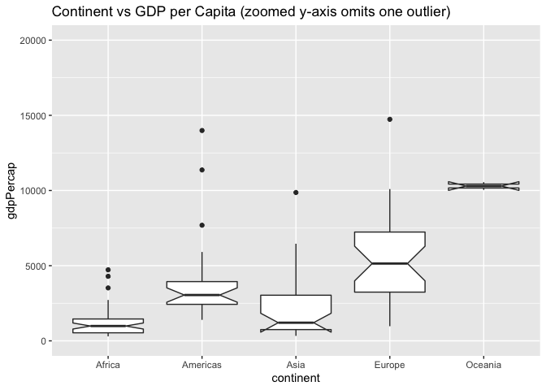
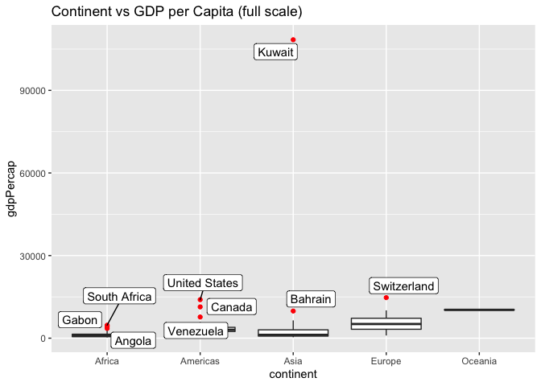
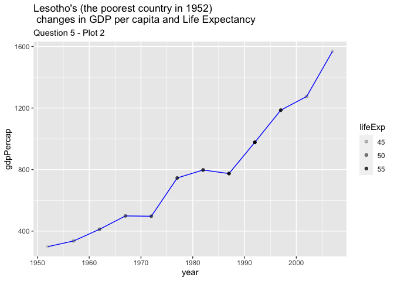
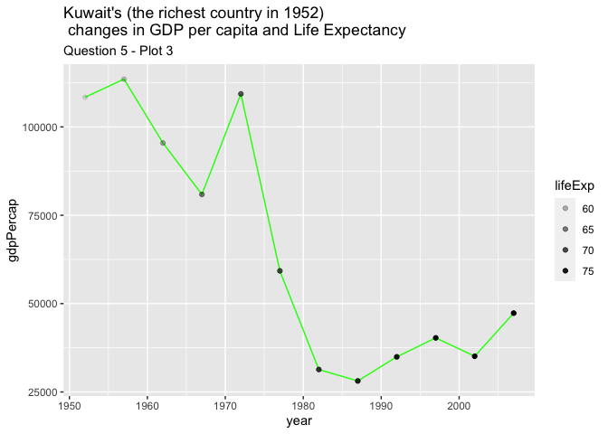
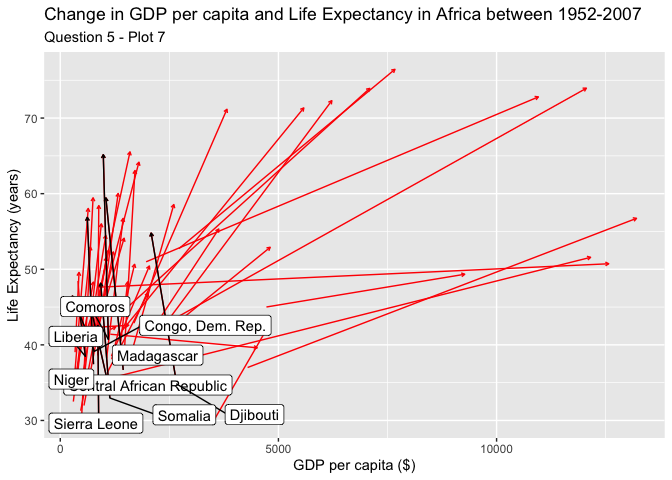

Gapminder
================
ingridmathilde
2020-07-22

  - [Grading Rubric](#grading-rubric)
      - [Individual](#individual)
      - [Team](#team)
      - [Due Date](#due-date)
  - [Guided EDA](#guided-eda)
  - [Your Own EDA](#your-own-eda)

*Purpose*: Learning to do EDA well takes practice\! In this challenge
you’ll further practice EDA by first completing a guided exploration,
then by conducting your own investigation. This challenge will also give
you a chance to use the wide variety of visual tools we’ve been
learning.

<!-- include-rubric -->

# Grading Rubric

<!-- -------------------------------------------------- -->

Unlike exercises, **challenges will be graded**. The following rubrics
define how you will be graded, both on an individual and team basis.

## Individual

<!-- ------------------------- -->

| Category    | Unsatisfactory                                                                   | Satisfactory                                                               |
| ----------- | -------------------------------------------------------------------------------- | -------------------------------------------------------------------------- |
| Effort      | Some task **q**’s left unattempted                                               | All task **q**’s attempted                                                 |
| Observed    | Did not document observations                                                    | Documented observations based on analysis                                  |
| Supported   | Some observations not supported by analysis                                      | All observations supported by analysis (table, graph, etc.)                |
| Code Styled | Violations of the [style guide](https://style.tidyverse.org/) hinder readability | Code sufficiently close to the [style guide](https://style.tidyverse.org/) |

## Team

<!-- ------------------------- -->

| Category   | Unsatisfactory                                                                                   | Satisfactory                                       |
| ---------- | ------------------------------------------------------------------------------------------------ | -------------------------------------------------- |
| Documented | No team contributions to Wiki                                                                    | Team contributed to Wiki                           |
| Referenced | No team references in Wiki                                                                       | At least one reference in Wiki to member report(s) |
| Relevant   | References unrelated to assertion, or difficult to find related analysis based on reference text | Reference text clearly points to relevant analysis |

## Due Date

<!-- ------------------------- -->

All the deliverables stated in the rubrics above are due on the day of
the class discussion of that exercise. See the
[Syllabus](https://docs.google.com/document/d/1jJTh2DH8nVJd2eyMMoyNGroReo0BKcJrz1eONi3rPSc/edit?usp=sharing)
for more information.

``` r
library(tidyverse)
```

    ## ── Attaching packages ────────────────────────────────────────────────────────── tidyverse 1.3.0 ──

    ## ✓ ggplot2 3.3.2     ✓ purrr   0.3.4
    ## ✓ tibble  3.0.1     ✓ dplyr   1.0.0
    ## ✓ tidyr   1.1.0     ✓ stringr 1.4.0
    ## ✓ readr   1.3.1     ✓ forcats 0.5.0

    ## ── Conflicts ───────────────────────────────────────────────────────────── tidyverse_conflicts() ──
    ## x dplyr::filter() masks stats::filter()
    ## x dplyr::lag()    masks stats::lag()

``` r
library(gapminder)
library(ggrepel)
```

*Background*: [Gapminder](https://www.gapminder.org/about-gapminder/) is
an independent organization that seeks to education people about the
state of the world. They promote a “fact-based worldview” by focusing on
data. The dataset we’ll study in this challenge is from Gapminder.

# Guided EDA

<!-- -------------------------------------------------- -->

First, we’ll go through a round of *guided EDA*. Try to pay attention to
the high-level process we’re going through—after this guided round
you’ll be responsible for doing another cycle of EDA on your own\!

**q0** Perform your “first checks” on the dataset. What variables are in
this dataset?

``` r
## TASK: Do your "first checks" here!
head(gapminder)
```

    ## # A tibble: 6 x 6
    ##   country     continent  year lifeExp      pop gdpPercap
    ##   <fct>       <fct>     <int>   <dbl>    <int>     <dbl>
    ## 1 Afghanistan Asia       1952    28.8  8425333      779.
    ## 2 Afghanistan Asia       1957    30.3  9240934      821.
    ## 3 Afghanistan Asia       1962    32.0 10267083      853.
    ## 4 Afghanistan Asia       1967    34.0 11537966      836.
    ## 5 Afghanistan Asia       1972    36.1 13079460      740.
    ## 6 Afghanistan Asia       1977    38.4 14880372      786.

``` r
glimpse(gapminder)
```

    ## Rows: 1,704
    ## Columns: 6
    ## $ country   <fct> Afghanistan, Afghanistan, Afghanistan, Afghanistan, Afghani…
    ## $ continent <fct> Asia, Asia, Asia, Asia, Asia, Asia, Asia, Asia, Asia, Asia,…
    ## $ year      <int> 1952, 1957, 1962, 1967, 1972, 1977, 1982, 1987, 1992, 1997,…
    ## $ lifeExp   <dbl> 28.801, 30.332, 31.997, 34.020, 36.088, 38.438, 39.854, 40.…
    ## $ pop       <int> 8425333, 9240934, 10267083, 11537966, 13079460, 14880372, 1…
    ## $ gdpPercap <dbl> 779.4453, 820.8530, 853.1007, 836.1971, 739.9811, 786.1134,…

``` r
summary(gapminder)
```

    ##         country        continent        year         lifeExp     
    ##  Afghanistan:  12   Africa  :624   Min.   :1952   Min.   :23.60  
    ##  Albania    :  12   Americas:300   1st Qu.:1966   1st Qu.:48.20  
    ##  Algeria    :  12   Asia    :396   Median :1980   Median :60.71  
    ##  Angola     :  12   Europe  :360   Mean   :1980   Mean   :59.47  
    ##  Argentina  :  12   Oceania : 24   3rd Qu.:1993   3rd Qu.:70.85  
    ##  Australia  :  12                  Max.   :2007   Max.   :82.60  
    ##  (Other)    :1632                                                
    ##       pop              gdpPercap       
    ##  Min.   :6.001e+04   Min.   :   241.2  
    ##  1st Qu.:2.794e+06   1st Qu.:  1202.1  
    ##  Median :7.024e+06   Median :  3531.8  
    ##  Mean   :2.960e+07   Mean   :  7215.3  
    ##  3rd Qu.:1.959e+07   3rd Qu.:  9325.5  
    ##  Max.   :1.319e+09   Max.   :113523.1  
    ## 

**Observations**:

  - **This dataset contains the following information:**
      - **Country**
      - **Continent**
      - **Year**
      - **Life Expentancy**
      - **Population**
      - **GDP per capita**

**q1** Determine the most and least recent years in the `gapminder`
dataset.

``` r
## TASK: Find the largest and smallest values of `year` in `gapminder`
year_max <- max(select(gapminder,year))
year_min <- min(select(gapminder, year))
```

Use the following test to check your work.

``` r
## NOTE: No need to change this
assertthat::assert_that(year_max %% 7 == 5)
```

    ## [1] TRUE

``` r
assertthat::assert_that(year_max %% 3 == 0)
```

    ## [1] TRUE

``` r
assertthat::assert_that(year_min %% 7 == 6)
```

    ## [1] TRUE

``` r
assertthat::assert_that(year_min %% 3 == 2)
```

    ## [1] TRUE

``` r
print("Nice!")
```

    ## [1] "Nice!"

**q2** Filter on years matching `year_min`, and make a plot of the GDE
per capita against continent. Choose an appropriate `geom_` to visualize
the data. What observations can you make?

You may encounter difficulties in visualizing these data; if so document
your challenges and attempt to produce the most informative visual you
can.

``` r
## TASK: Create a visual of gdpPercap vs continent
gapminder %>% 
  filter(year == year_min) %>% 
  ggplot() +
  geom_boxplot(aes(x = continent, y = gdpPercap)) +
  labs(title = "Continent vs GDP per Capita (full scale)")
```

<!-- -->

``` r
gapminder %>% 
  filter(year == year_min) %>% 
  ggplot() +
  geom_boxplot(aes(x = continent, y = gdpPercap), notch = TRUE) +
  coord_cartesian(ylim = c(0,20000))+
  labs(title = "Continent vs GDP per Capita (zoomed y-axis omits one outlier)")
```

    ## notch went outside hinges. Try setting notch=FALSE.
    ## notch went outside hinges. Try setting notch=FALSE.

<!-- -->

***Observations***:

  - **Generally, Oceania has a greater GDP per Capita, followed by
    Europe, then the Americas, then Asia, then Africa.**
  - **Per continent there are outliers:**
      - **Africa: 3**
      - **Americas: 3**
      - **Asia : 2**
      - **Europe : 1**
      - **Oceania: 0**
  - **The GDP per Capita is the most spread for Europe, followed by
    Asia, then Americas, then Africa, then Oceania.**

***Difficulties & Approaches***:

  - **Because of the greatest outlier for Asia, the scale of the graph
    made it difficult to understand the data - so I used
    coord\_cartesian to zoom into the data.**

**q3** You should have found at least three outliers in q2. Identify
those outliers (figure out which countries they are).

*Note*: I realize the reasons for

``` r
## TASK: Identify the outliers from q2

describe_continent_min <- gapminder %>%
  filter(year == year_min) %>% 
  group_by(continent) %>% 
  mutate(min = min(gdpPercap),
        max = max(gdpPercap),
        median = median(gdpPercap),
        IQRange = IQR(gdpPercap),
        lower = quantile(gdpPercap, 0.25) - 1.5 * IQR(gdpPercap),
        upper = quantile(gdpPercap, 0.75) + 1.5 * IQR(gdpPercap)
            ) %>% 
  ungroup() %>% 
  filter(upper < gdpPercap)

gapminder %>% 
  filter(year == year_min) %>% 
  ggplot(
    aes(x = continent, 
        y = gdpPercap)) +
  geom_boxplot(outlier.color = "red") +
  geom_label_repel(
    data = describe_continent_min, 
    mapping = aes(label = country)) +
  labs(title = "Continent vs GDP per Capita (full scale)")
```

<!-- -->

``` r
gapminder %>% 
  filter(year == year_min) %>% 
  ggplot(
    aes(x = continent, 
        y = gdpPercap)) +
  geom_boxplot(notch = TRUE, outlier.color = "red") +
  geom_label_repel(
    data = describe_continent_min, 
    mapping = aes(label = country)) +
  coord_cartesian(ylim = c(0,20000))+
  labs(title = "Continent vs GDP per Capita (zoomed y-axis omits one outlier)")
```

    ## notch went outside hinges. Try setting notch=FALSE.
    ## notch went outside hinges. Try setting notch=FALSE.

<!-- -->

***Observations***:

  - **My solution is quick and dirty but hey, it works.**
  - **The countries are:**
      - **Kuwait**
      - **Switzerland**
      - **Bahrain**
      - **United States**
      - **Canada**
      - **Venezuela**
      - **South Africa**
      - **Gabon**
      - **Angola**

**q4** Create a plot similar to yours from q2 studying both `year_min`
and `year_max`. Find a way to highlight the outliers from q3 on your
plot. Compare the patterns between `year_min` and `year_max`.

*Hint*: We’ve learned a lot of different ways to show multiple
variables; think about using different aesthetics or facets.

``` r
## TASK: Create a visual of gdpPercap vs continent
describe_continent_max <- gapminder %>%
  filter(year == year_max) %>% 
  group_by(continent) %>% 
  mutate(min = min(gdpPercap),
        max = max(gdpPercap),
        median = median(gdpPercap),
        IQRange = IQR(gdpPercap),
        lower = quantile(gdpPercap, 0.25) - 1.5 * IQR(gdpPercap),
        upper = quantile(gdpPercap, 0.75) + 1.5 * IQR(gdpPercap)
            ) %>% 
  ungroup() %>% 
  filter(upper < gdpPercap)

gapminder %>% 
  filter(year == year_min | year == year_max) %>% 
  ggplot(aes(x = continent, y = gdpPercap)) +
  geom_boxplot(outlier.color = "red") +
  facet_grid(.~year) +
  labs(title = "Continent vs GDP per Capita (full scale)")
```

<!-- -->

``` r
gapminder %>% 
  filter(year == year_min | year == year_max) %>% 
  ggplot(aes(x = continent, y = gdpPercap)) +
  geom_boxplot(outlier.color = "red") +
  geom_label_repel(
    data = describe_continent_min, 
    mapping = aes(label = country)) +
  geom_label_repel(
    data = describe_continent_max, 
    mapping = aes(label = country)) +
  facet_grid(.~year) +
  labs(title = "Continent vs GDP per Capita (full scale)") 
```

<!-- -->

**Observations**:

  - **The GDP across the world has increased from 1952-2007.**
  - **The variability of GDP has increased within each continent from
    1952-2007.**
  - **The countries that continue to be outliers compared to their
    continent are:**
      - **Gabon**
      - **South Africa**
      - **United States**
      - **Canada**

# Your Own EDA

<!-- -------------------------------------------------- -->

Now it’s your turn\! We just went through guided EDA considering the GDP
per capita at two time points. You can continue looking at outliers,
consider different years, repeat the exercise with `lifeExp`, consider
the relationship between variables, or something else entirely.

**q5** Create *at least* three new figures below. With each figure, try
to pose new questions about the data.

``` r
## TASK: Your first graph

gapminder %>%
  filter(year == year_max | year == year_min) %>%
  group_by(year) %>% 
  mutate(
    gdp_year_median = median(gdpPercap), 
    life_year_median = median(lifeExp), 
    comp_gdp = gdpPercap/gdp_year_median,
    comp_life = lifeExp/life_year_median
    ) %>% 
  ggplot(
    aes(
      x = comp_gdp, 
      y = comp_life
      )
    ) +
  geom_point(aes(color = as.factor(year))) +
  labs(title = "Comparative GDP per capita vs Comparative Life Expectancy", 
       subtitle = "Question 5 - Plot 1 ",
       x = "GDP/median GDP per capita per year",
       y = "Life Expectancy/median Life Expectancy per year"
       )
```

<!-- -->

***Observations***

  - **In 1952, comparatively higher GDP is associated with comparatively
    higher life expectancy.**
  - **In 2007, comparatively higher GDP does not confer a significantly
    higher life expectancy.**
  - **In 1952, the comparative disparity in life expectancy was higher
    and GDP was was about the same than those in 2007.**
  - **This is a trend in the world, but is this trend true for the
    ‘worst off’ countries in the world?**

<!-- end list -->

``` r
## TASK: Your second graph
lowest_gdp <- gapminder %>%
  filter(year == year_min) %>% 
  arrange(desc(gdpPercap))

lowest_life <- gapminder %>%
  filter(year == year_min) %>% 
  arrange(desc(lifeExp))

gapminder %>% 
  filter(country == "Lesotho") %>% 
  ggplot(aes(x = year, y = gdpPercap)) +
  geom_line(color = "blue") +
  geom_point(aes(alpha = lifeExp)) +
  labs(
    title = "Lesotho's (the poorest country in 1952)\n changes in GDP per capita and Life Expectancy",
    subtitle = "Question 5 - Plot 2")
```

<!-- -->

``` r
gapminder %>% 
  filter(country == "Kuwait") %>% 
  ggplot(aes(x = year, y = gdpPercap)) +
  geom_line(color = "green") +
  geom_point(aes(alpha = lifeExp)) +
  labs(
    title = "Kuwait's (the richest country in 1952)\n changes in GDP per capita and Life Expectancy",
    subtitle = "Question 5 - Plot 3")
```

<!-- -->

``` r
gapminder %>% 
  filter(country == "Afghanistan") %>% 
  ggplot(aes(x = year, y = gdpPercap)) +
  geom_line(color = "red") +
  geom_point(aes(alpha = lifeExp)) +
  labs(
    title = "Afghanistan's (the country with the lowest life expectancy in 1952)\n changes in GDP per capita and Life Expectancy",
    subtitle = "Question 5 - Plot 4")
```

<!-- -->

``` r
gapminder %>% 
  filter(country == "Norway") %>% 
  ggplot(aes(x = year, y = gdpPercap)) +
  geom_line(color = "yellow") +
  geom_point(aes(alpha = lifeExp)) +
  labs(
    title = "Norway's (the country with the highest life expectancy in 1952)\n changes in GDP per capita and Life Expectancy",
    subtitle = "Question 5 - Plot 5")
```

<!-- -->

***Observations***

  - **The trend previously discuss (higher GDP per capita associated
    with higher life expectancy) would dictate that as GDP increases,
    the life expectancy increases.**
  - **For the ‘worst-off’ countries in the world in 1952, there is not a
    direct correlation between GPD per capita and life expectancy as it
    changed over time.**
  - **Meanwhile, for countries that started rich or with a higher life
    expectancy, the changes in fortune were low enough that again this
    correlation does not hold.**
  - **Obviously GDP is not the only factor at play - war, famine, health
    crises can all affect life expectancy. Both
    [Afghanistan](https://en.wikipedia.org/wiki/History_of_Afghanistan#Contemporary_era_\(1973%E2%80%93present\))
    and
    [Lesotho](https://en.wikipedia.org/wiki/History_of_Lesotho#Kingdom_of_Lesotho)
    have experienced armed conflicts, famine, and widespread
    inaccessibility to healthcare throughout their histories.**

<!-- end list -->

``` r
## TASK: Your third graph

describe_country <- gapminder %>%
  filter(year == year_min | year == year_max & !is.na(gdpPercap) & !is.na(lifeExp)) %>%
  select(-pop) %>% 
  pivot_wider(names_from = year, values_from = c(lifeExp, gdpPercap))

weirdos <- describe_country %>%
  filter(gdpPercap_1952 > gdpPercap_2007)
  
weirdos
```

    ## # A tibble: 12 x 6
    ##    country     continent lifeExp_1952 lifeExp_2007 gdpPercap_1952 gdpPercap_2007
    ##    <fct>       <fct>            <dbl>        <dbl>          <dbl>          <dbl>
    ##  1 Central Af… Africa            35.5         44.7          1071.           706.
    ##  2 Comoros     Africa            40.7         65.2          1103.           986.
    ##  3 Congo, Dem… Africa            39.1         46.5           781.           278.
    ##  4 Djibouti    Africa            34.8         54.8          2670.          2082.
    ##  5 Haiti       Americas          37.6         60.9          1840.          1202.
    ##  6 Kuwait      Asia              55.6         77.6        108382.         47307.
    ##  7 Liberia     Africa            38.5         45.7           576.           415.
    ##  8 Madagascar  Africa            36.7         59.4          1443.          1045.
    ##  9 Nicaragua   Americas          42.3         72.9          3112.          2749.
    ## 10 Niger       Africa            37.4         56.9           762.           620.
    ## 11 Sierra Leo… Africa            30.3         42.6           880.           863.
    ## 12 Somalia     Africa            33.0         48.2          1136.           926.

``` r
describe_country %>% 
  ggplot(
    aes(
      x = gdpPercap_1952, 
      y = lifeExp_1952
      )
  ) +
  geom_segment(
    aes(
      xend = gdpPercap_2007, 
      yend = lifeExp_2007, 
      color = continent
  ), 
    arrow = arrow(length = unit(0.1,"cm"))) +
  geom_label_repel(
    data = filter(weirdos, continent != "Africa"),
    mapping = aes(label = country)
  ) +
  facet_grid(continent~.) +
  labs(title = "Change in GDP per capita and Life Expectancy between 1952-2007", 
       subtitle = "Question 5 - Plot 6 ",
       x = "GDP per capita ($)",
       y = "Life Expectancy (years)"
       )
```

<!-- -->

``` r
describe_country %>%
  filter(continent == "Africa") %>% 
  ggplot(
    aes(
      x = gdpPercap_1952, 
      y = lifeExp_1952
      )
  ) +
  geom_segment(
    aes(
      xend = gdpPercap_2007, 
      yend = lifeExp_2007, 
      color = "Increases"
      ), 
    color = "red",
    arrow = arrow(length = unit(0.1,"cm"))
  ) +
   geom_segment(
     data = filter(weirdos, continent == "Africa"),
     mapping = aes(
      xend = gdpPercap_2007, 
      yend = lifeExp_2007, 
      color = "Decreases"
      ),
     color = "black",
     arrow = arrow(length = unit(0.1,"cm"))
  ) +
  geom_label_repel(
    data = filter(weirdos, continent == "Africa"),
    mapping = aes(label = country)
  ) +
  labs(title = "Change in GDP per capita and Life Expectancy in Africa between 1952-2007", 
       subtitle = "Question 5 - Plot 7 ",
       x = "GDP per capita ($)",
       y = "Life Expectancy (years)"
       )
```

<!-- -->

***Observations***

  - **Europe and Asia demonstrate the greates change in GDP per capita
    and Life Expectancy.**
  - **In the Americas and Asia, only Kuwait, Haiti, and Nicaragua
    demonstrate a decrease in either GDP per capita or life expectancy
    between 1952-2007.**
  - **In Africa, 11 countries demonstrate a decrease in either GDP per
    capita between 1952-2007: Zimbabwe, Swaziland, Comoros, Democractic
    Republic of Congo, Liberia, Madagascar, Niger, Centreal African
    REpublic, Djibouti, Sierra Leone, and Somalia.**
  - **Most countries are “richer” and all have a longer life expectancy
    between 1952-2007.**
