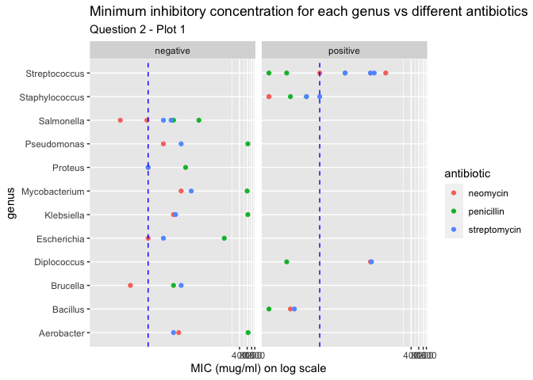

Antibiotics
================
ingridmathilde
2020-07-27

  - [Grading Rubric](#grading-rubric)
      - [Individual](#individual)
      - [Team](#team)
      - [Due Date](#due-date)
  - [Visualization](#visualization)
      - [Purpose: Compare Effectiveness](#purpose-compare-effectiveness)
      - [Purpose: Categorize Bacteria](#purpose-categorize-bacteria)
  - [References](#references)

*Purpose*: To create an effective visualization, we need to keep our
*purpose* firmly in mind. There are many different ways to visualize
data, and the only way we can judge efficacy is with respect to our
purpose.

In this challenge you’ll visualize the same data in two different ways,
aimed at two different purposes.

*Note*: Please complete your initial visual design **alone**. Work on
both of your graphs alone, and save a version to your repo *before*
coming together with your team. This way you can all bring a diversity
of ideas to the table\!

<!-- include-rubric -->

# Grading Rubric

<!-- -------------------------------------------------- -->

Unlike exercises, **challenges will be graded**. The following rubrics
define how you will be graded, both on an individual and team basis.

## Individual

<!-- ------------------------- -->

| Category    | Unsatisfactory                                                                   | Satisfactory                                                               |
| ----------- | -------------------------------------------------------------------------------- | -------------------------------------------------------------------------- |
| Effort      | Some task **q**’s left unattempted                                               | All task **q**’s attempted                                                 |
| Observed    | Did not document observations                                                    | Documented observations based on analysis                                  |
| Supported   | Some observations not supported by analysis                                      | All observations supported by analysis (table, graph, etc.)                |
| Code Styled | Violations of the [style guide](https://style.tidyverse.org/) hinder readability | Code sufficiently close to the [style guide](https://style.tidyverse.org/) |

## Team

<!-- ------------------------- -->

| Category   | Unsatisfactory                                                                                   | Satisfactory                                       |
| ---------- | ------------------------------------------------------------------------------------------------ | -------------------------------------------------- |
| Documented | No team contributions to Wiki                                                                    | Team contributed to Wiki                           |
| Referenced | No team references in Wiki                                                                       | At least one reference in Wiki to member report(s) |
| Relevant   | References unrelated to assertion, or difficult to find related analysis based on reference text | Reference text clearly points to relevant analysis |

## Due Date

<!-- ------------------------- -->

All the deliverables stated in the rubrics above are due on the day of
the class discussion of that exercise. See the
[Syllabus](https://docs.google.com/document/d/1jJTh2DH8nVJd2eyMMoyNGroReo0BKcJrz1eONi3rPSc/edit?usp=sharing)
for more information.

``` r
library(tidyverse)
```

    ## ── Attaching packages ────────────────────────────────────────────────────────── tidyverse 1.3.0 ──

    ## ✓ ggplot2 3.3.2     ✓ purrr   0.3.4
    ## ✓ tibble  3.0.1     ✓ dplyr   1.0.0
    ## ✓ tidyr   1.1.0     ✓ stringr 1.4.0
    ## ✓ readr   1.3.1     ✓ forcats 0.5.0

    ## ── Conflicts ───────────────────────────────────────────────────────────── tidyverse_conflicts() ──
    ## x dplyr::filter() masks stats::filter()
    ## x dplyr::lag()    masks stats::lag()

``` r
library(ggrepel)
library(cowplot)
```

    ## 
    ## ********************************************************

    ## Note: As of version 1.0.0, cowplot does not change the

    ##   default ggplot2 theme anymore. To recover the previous

    ##   behavior, execute:
    ##   theme_set(theme_cowplot())

    ## ********************************************************

*Background*: The data\[1\] we study in this challenge report the
[*minimum inhibitory
concentration*](https://en.wikipedia.org/wiki/Minimum_inhibitory_concentration)
(MIC) of three drugs for different bacteria. The smaller the MIC for a
given drug and bacteria pair, the more practical the drug is for
treating that particular bacteria. An MIC value of *at most* 0.1 is
considered necessary for treating human patients.

These data report MIC values for three antibiotics—penicillin,
streptomycin, and neomycin—on 16 bacteria. Bacteria are categorized into
a genus based on a number of features, including their resistance to
antibiotics.

``` r
## NOTE: If you extracted all challenges to the same location,
## you shouldn't have to change this filename
filename <- "./data/antibiotics.csv"

## Load the data
df_antibiotics <- read_csv(filename)
```

    ## Parsed with column specification:
    ## cols(
    ##   bacteria = col_character(),
    ##   penicillin = col_double(),
    ##   streptomycin = col_double(),
    ##   neomycin = col_double(),
    ##   gram = col_character()
    ## )

``` r
df_antibiotics %>% knitr::kable()
```

| bacteria                        | penicillin | streptomycin | neomycin | gram     |
| :------------------------------ | ---------: | -----------: | -------: | :------- |
| Aerobacter aerogenes            |    870.000 |         1.00 |    1.600 | negative |
| Brucella abortus                |      1.000 |         2.00 |    0.020 | negative |
| Bacillus anthracis              |      0.001 |         0.01 |    0.007 | positive |
| Diplococcus pneumonia           |      0.005 |        11.00 |   10.000 | positive |
| Escherichia coli                |    100.000 |         0.40 |    0.100 | negative |
| Klebsiella pneumoniae           |    850.000 |         1.20 |    1.000 | negative |
| Mycobacterium tuberculosis      |    800.000 |         5.00 |    2.000 | negative |
| Proteus vulgaris                |      3.000 |         0.10 |    0.100 | negative |
| Pseudomonas aeruginosa          |    850.000 |         2.00 |    0.400 | negative |
| Salmonella (Eberthella) typhosa |      1.000 |         0.40 |    0.008 | negative |
| Salmonella schottmuelleri       |     10.000 |         0.80 |    0.090 | negative |
| Staphylococcus albus            |      0.007 |         0.10 |    0.001 | positive |
| Staphylococcus aureus           |      0.030 |         0.03 |    0.001 | positive |
| Streptococcus fecalis           |      1.000 |         1.00 |    0.100 | positive |
| Streptococcus hemolyticus       |      0.001 |        14.00 |   10.000 | positive |
| Streptococcus viridans          |      0.005 |        10.00 |   40.000 | positive |

# Visualization

<!-- -------------------------------------------------- -->

## Purpose: Compare Effectiveness

<!-- ------------------------- -->

**q1** Create a visualization of `df_antibiotics` that helps you to
compare the effectiveness of the three antibiotics across all the
bacteria reported. Can you make any broad statements about antibiotic
effectiveness?

``` r
## TASK: Create your visualization
df_antibiotics_longer <- df_antibiotics %>% 
  pivot_longer(
    cols = c(-bacteria, -gram),
    names_to = "antibiotic",
    values_to = "value"
  )

p1 <- df_antibiotics_longer %>% 
  ggplot(
    aes(
      x = antibiotic, 
      y = value
      )
  ) +
  geom_hline(yintercept = 0.1, linetype = "dashed", color = "blue") +
  geom_boxplot(outlier.shape = NA) +
  geom_jitter(aes(color = gram)) +
  facet_grid(.~gram) +
  labs(
    title = "Trends in minimum inhibitory concentration vs different antibiotics",
    subtitle = "Question 1 - Plot 1",
    y = "MIC (mug/ml) on log scale"
  )  +
  coord_trans(y = "log")

p1
```

<!-- -->

**Observations**:

  - **Gram negative strains are most sensitive to neomycin, then to
    streptomycin, then to penicillin.**
  - **Gram negative bacteria tend to have a greater range and value of
    MIC for penicillin - perhaps there are more resistant strains of
    gram negative bacteria in this data set.**
  - **Gram positive bacteria strains are most sensitive to penicillin,
    then to neomycin, then to streptomycin.**
  - **Most bacterial strains are most sensitive to neomycin.**
  - **Gram negative strains are best treated using neomycin (though it
    is likley to be effective against just over 50% of bacteria that fit
    into this category if using 0.1 mug/ml concetration). Gram positive
    strains are best treated using penicillin (effective against all but
    one strain in the data set if using 0.1 mug/ml concentration).**

## Purpose: Categorize Bacteria

<!-- ------------------------- -->

The *genus* of a living organism is a human categorization, based on
various characteristics of the organism. Since these categories are
based on numerous factors, we will tend to see clusters if we visualize
data according to relevant variables. We can use these visuals to
categorize observations, and to question whether given categories are
reasonable\!

**q2** Create a visualization of `df_antibiotics` that helps you to
categorize bacteria according to the variables in the data. Document
your observations on how how clusters of bacteria in the variables do—or
don’t—align with their *genus* classification.

``` r
## TASK: Create your visualization

df_antibiotics2 <- df_antibiotics %>% 
  separate(
    bacteria, 
    into = c("genus", "species"), 
    sep = " ", 
    remove = FALSE
  ) %>% 
  mutate(
    shape = case_when(
      genus == "Diplococcus" ~ "spherical",
      genus == "Staphylococcus" ~ "spherical",
      genus == "Streptococcus" ~ "spherical",
      TRUE ~ "rod"
    )
  ) %>% 
  pivot_longer(
    cols = c(penicillin, neomycin, streptomycin),
    names_to = "antibiotic",
    values_to = "value"
  )
```

    ## Warning: Expected 2 pieces. Additional pieces discarded in 1 rows [10].

``` r
df_antibiotics2
```

    ## # A tibble: 48 x 7
    ##    bacteria            genus      species   gram    shape    antibiotic    value
    ##    <chr>               <chr>      <chr>     <chr>   <chr>    <chr>         <dbl>
    ##  1 Aerobacter aerogen… Aerobacter aerogenes negati… rod      penicillin  870    
    ##  2 Aerobacter aerogen… Aerobacter aerogenes negati… rod      neomycin      1.6  
    ##  3 Aerobacter aerogen… Aerobacter aerogenes negati… rod      streptomyc…   1    
    ##  4 Brucella abortus    Brucella   abortus   negati… rod      penicillin    1    
    ##  5 Brucella abortus    Brucella   abortus   negati… rod      neomycin      0.02 
    ##  6 Brucella abortus    Brucella   abortus   negati… rod      streptomyc…   2    
    ##  7 Bacillus anthracis  Bacillus   anthracis positi… rod      penicillin    0.001
    ##  8 Bacillus anthracis  Bacillus   anthracis positi… rod      neomycin      0.007
    ##  9 Bacillus anthracis  Bacillus   anthracis positi… rod      streptomyc…   0.01 
    ## 10 Diplococcus pneumo… Diplococc… pneumonia positi… spheric… penicillin    0.005
    ## # … with 38 more rows

``` r
df_antibiotics2 %>% 
  ggplot(aes(y = genus, x = value, color = antibiotic)) +
  geom_point() +
  geom_vline(
    xintercept = 0.1, 
    linetype = "dashed", 
    color = "blue"
  ) +
  facet_grid(.~gram) +
  coord_trans(x = "log") +
  labs(
    title = "Minimum inhibitory concentration for each genus vs different antibiotics",
    subtitle = "Question 2 - Plot 1",
    x = "MIC (mug/ml) on log scale"
  )
```

<!-- -->

***Observations***:

  - **Penicillin is effective for treating humans (MIC \< 0.1 mug/ml)
    against the represented strains of Streptococcus, Staphylococcus,
    Diplococcus, and Bacillus.**
  - **Neomycin is effective for treating humans (MIS \< 0.1 mug/ml)
    against Staphylococcus, Salmonella, Escherichia, Bucella, and
    Bacillus.**
  - **Streptomycin is effective for treating humans (MIS \< 0.1 mug/ml)
    against Staphylococcus, Proteus, and Bacillus.**
  - **None of the antibiotics are effective for treating Pseudomonas,
    Mycobacterium, Klebsiella, or Aerobacter.**
  - **[Gram
    negative](https://en.wikipedia.org/wiki/Gram-negative_bacteria)
    bacterial strains in this dataset are more drug-resistant than Gram
    positive bacertial strains. Gram positive bacteria strains have a
    physical defensive layer against antibiotics that can be pierced by
    penicillin. Meanwhile, the Gram negative bacertial strains have
    developed/possess other defenses against antibiotics ([efflux
    pumps](https://www.ncbi.nlm.nih.gov/pmc/articles/PMC3711980/),
    [mutation](https://www.ncbi.nlm.nih.gov/pmc/articles/PMC89960/), and
    [lactamase
    production](https://en.wikipedia.org/wiki/Beta-lactamase)).**

# References

<!-- -------------------------------------------------- -->

\[1\] Neomycin in skin infections: A new topical antibiotic with wide
antibacterial range and rarely sensitizing. Scope. 1951;3(5):4-7.

\[2\] Wainer and Lysen, “That’s Funny…” /American Scientist/ (2009)
[link](https://www.americanscientist.org/article/thats-funny)
