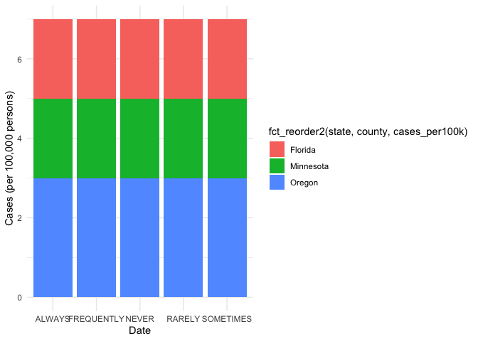

COVID-19
================
ingridmathilde
2020-07-27

  - [Grading Rubric](#grading-rubric)
      - [Individual](#individual)
      - [Team](#team)
      - [Due Date](#due-date)
  - [The Big Picture](#the-big-picture)
  - [Get the Data](#get-the-data)
      - [Navigating the Census Bureau](#navigating-the-census-bureau)
      - [Automated Download of NYT
        Data](#automated-download-of-nyt-data)
  - [Join the Data](#join-the-data)
  - [Analyze](#analyze)
      - [Normalize](#normalize)
      - [Guided EDA](#guided-eda)
      - [Self-directed EDA](#self-directed-eda)
          - [Ideas](#ideas)
          - [Aside: Some visualization
            tricks](#aside-some-visualization-tricks)
          - [Geographic exceptions](#geographic-exceptions)
  - [Notes](#notes)

*Purpose*: We can’t *possibly* do a class on data science and *not* look
at covid-19. Come on.

In this challenge, you’ll learn how to navigate the U.S. Census Bureau
website, programmatically download data from the internet, and perform a
county-level population-weighted analysis of current covid-19 trends.
Get excited\!

<!-- include-rubric -->

# Grading Rubric

<!-- -------------------------------------------------- -->

Unlike exercises, **challenges will be graded**. The following rubrics
define how you will be graded, both on an individual and team basis.

## Individual

<!-- ------------------------- -->

| Category    | Unsatisfactory                                                                   | Satisfactory                                                               |
| ----------- | -------------------------------------------------------------------------------- | -------------------------------------------------------------------------- |
| Effort      | Some task **q**’s left unattempted                                               | All task **q**’s attempted                                                 |
| Observed    | Did not document observations                                                    | Documented observations based on analysis                                  |
| Supported   | Some observations not supported by analysis                                      | All observations supported by analysis (table, graph, etc.)                |
| Code Styled | Violations of the [style guide](https://style.tidyverse.org/) hinder readability | Code sufficiently close to the [style guide](https://style.tidyverse.org/) |

## Team

<!-- ------------------------- -->

| Category   | Unsatisfactory                                                                                   | Satisfactory                                       |
| ---------- | ------------------------------------------------------------------------------------------------ | -------------------------------------------------- |
| Documented | No team contributions to Wiki                                                                    | Team contributed to Wiki                           |
| Referenced | No team references in Wiki                                                                       | At least one reference in Wiki to member report(s) |
| Relevant   | References unrelated to assertion, or difficult to find related analysis based on reference text | Reference text clearly points to relevant analysis |

## Due Date

<!-- ------------------------- -->

All the deliverables stated in the rubrics above are due on the day of
the class discussion of that exercise. See the
[Syllabus](https://docs.google.com/document/d/1jJTh2DH8nVJd2eyMMoyNGroReo0BKcJrz1eONi3rPSc/edit?usp=sharing)
for more information.

``` r
library(tidyverse)
```

    ## ── Attaching packages ────────────────────────────────────────────────────────────────── tidyverse 1.3.0 ──

    ## ✓ ggplot2 3.3.2     ✓ purrr   0.3.4
    ## ✓ tibble  3.0.1     ✓ dplyr   1.0.0
    ## ✓ tidyr   1.1.0     ✓ stringr 1.4.0
    ## ✓ readr   1.3.1     ✓ forcats 0.5.0

    ## ── Conflicts ───────────────────────────────────────────────────────────────────── tidyverse_conflicts() ──
    ## x dplyr::filter() masks stats::filter()
    ## x dplyr::lag()    masks stats::lag()

``` r
library(lubridate)
```

    ## 
    ## Attaching package: 'lubridate'

    ## The following objects are masked from 'package:base':
    ## 
    ##     date, intersect, setdiff, union

``` r
library(ggrepel)
```

*Background*:
[COVID-19](https://en.wikipedia.org/wiki/Coronavirus_disease_2019) is
the disease caused by the virus SARS-CoV-2. In 2020 it became a global
pandemic, leading to huge loss of life and tremendous disruption to
society. The New York Times published up-to-date data on the progression
of the pandemic across the United States—we will study these data in
this challenge.

# The Big Picture

<!-- -------------------------------------------------- -->

We’re about to go through *a lot* of weird steps, so let’s first fix the
big picture firmly in mind:

We want to study COVID-19 in terms of data: both case counts (number of
infections) and deaths. We’re going to do a county-level analysis in
order to get a high-resolution view of the pandemic. Since US counties
can vary widely in terms of their population, we’ll need population
estimates in order to compute infection rates (think back to the
`Titanic` challenge).

That’s the high-level view; now let’s dig into the details.

# Get the Data

<!-- -------------------------------------------------- -->

1.  County-level population estimates (Census Bureau)
2.  County-level COVID-19 counts (New York Times)

## Navigating the Census Bureau

<!-- ------------------------- -->

**Steps**: Our objective is to find the 2018 American Community
Survey\[1\] (ACS) Total Population estimates, disaggregated by counties.
To check your results, this is Table `B01003`.

1.  Go to [data.census.gov](data.census.gov).
2.  Scroll down and click `View Tables`.
3.  Apply filters to find the ACS Total Population estimates,
    disaggregated by counties. I used the filters:

<!-- end list -->

  - `Topics > Populations and People > Counts, Estimates, and
    Projections > Population Total`
  - `Geography > County > All counties in United States`

<!-- end list -->

5.  Click the `Download` button to download the data; make sure to
    select the 2018 y-year estimates.
6.  Unzip and move the data to your `challenges/data` folder.

<!-- end list -->

  - Note that the data will have the crazy-long filename
    `ACSDT5Y2018.B01003_data_with_overlays_2020-06-30T102151.csv`.
    That’s because metadata is stored in the filename, such as the
    year of the estimate (`Y2018`) and my access date (`2020-06-30`).

**q1** Load Table `B01003` into the following tibble. Make sure the
column names are `id, Geographic Area Name, Estimate!!Total, Margin of
Error!!Total`.

*Hint*: You will need to use the `skip` keyword when loading these
data\!

``` r
## TASK: Load the census bureau data with the following tibble name.
df_pop <- read_csv("./data/ACSDT5Y2018.B01003_2020-07-28T161329/ACSDT5Y2018.B01003_data_with_overlays_2020-07-21T092815.csv", skip = 1)
```

    ## Parsed with column specification:
    ## cols(
    ##   id = col_character(),
    ##   `Geographic Area Name` = col_character(),
    ##   `Estimate!!Total` = col_double(),
    ##   `Margin of Error!!Total` = col_character()
    ## )

*Note*: You can find information on 1-year, 3-year, and 5-year estimates
[here](https://www.census.gov/programs-surveys/acs/guidance/estimates.html).
The punchline is that 5-year estimates are more reliable but less
current.

## Automated Download of NYT Data

<!-- ------------------------- -->

ACS 5-year estimates don’t change all that often, but the COVID-19 data
are changing rapidly. To that end, it would be nice to be able to
*programmatically* download the most recent data for analysis; that way
we can update our analysis whenever we want simply by re-running our
notebook. This next problem will have you set up such a pipeline.

The New York Times is publishing up-to-date data on COVID-19 on
[GitHub](https://github.com/nytimes/covid-19-data).

**q2** Visit the NYT [GitHub](https://github.com/nytimes/covid-19-data)
repo and find the URL for the **raw** US County-level data. Assign that
URL as a string to the variable below.

``` r
## TASK: Find the URL for the NYT covid-19 county-level data
url_counties <- "https://raw.githubusercontent.com/nytimes/covid-19-data/master/us-counties.csv"
```

Once you have the url, the following code will download a local copy of
the data, then load the data into R.

``` r
## NOTE: No need to change this; just execute
## Set the filename of the data to download
filename_nyt <- "./data/nyt_counties.csv"

## Download the data locally
curl::curl_download(
        url_counties,
        destfile = filename_nyt
      )

## Loads the downloaded csv
df_covid <- read_csv(filename_nyt)
```

    ## Parsed with column specification:
    ## cols(
    ##   date = col_date(format = ""),
    ##   county = col_character(),
    ##   state = col_character(),
    ##   fips = col_character(),
    ##   cases = col_double(),
    ##   deaths = col_double()
    ## )

You can now re-run the chunk above (or the entire notebook) to pull the
most recent version of the data. Thus you can periodically re-run this
notebook to check in on the pandemic as it evolves.

*Note*: You should feel free to copy-paste the code above for your own
future projects\!

# Join the Data

<!-- -------------------------------------------------- -->

To get a sense of our task, let’s take a glimpse at our two data
sources.

``` r
## NOTE: No need to change this; just execute
df_pop %>% glimpse
```

    ## Rows: 3,221
    ## Columns: 4
    ## $ id                       <chr> "0500000US01001", "0500000US01003", "0500000…
    ## $ `Geographic Area Name`   <chr> "Autauga County, Alabama", "Baldwin County, …
    ## $ `Estimate!!Total`        <dbl> 55200, 208107, 25782, 22527, 57645, 10352, 2…
    ## $ `Margin of Error!!Total` <chr> "*****", "*****", "*****", "*****", "*****",…

``` r
df_covid %>% glimpse
```

    ## Rows: 389,202
    ## Columns: 6
    ## $ date   <date> 2020-01-21, 2020-01-22, 2020-01-23, 2020-01-24, 2020-01-24, 2…
    ## $ county <chr> "Snohomish", "Snohomish", "Snohomish", "Cook", "Snohomish", "O…
    ## $ state  <chr> "Washington", "Washington", "Washington", "Illinois", "Washing…
    ## $ fips   <chr> "53061", "53061", "53061", "17031", "53061", "06059", "17031",…
    ## $ cases  <dbl> 1, 1, 1, 1, 1, 1, 1, 1, 1, 1, 1, 1, 1, 1, 1, 1, 1, 1, 1, 1, 1,…
    ## $ deaths <dbl> 0, 0, 0, 0, 0, 0, 0, 0, 0, 0, 0, 0, 0, 0, 0, 0, 0, 0, 0, 0, 0,…

To join these datasets, we’ll need to use [FIPS county
codes](https://en.wikipedia.org/wiki/FIPS_county_code).\[2\] The last
`5` digits of the `id` column in `df_pop` is the FIPS county code, while
the NYT data `df_covid` already contains the `fips`.

**q3** Process the `id` column of `df_pop` to create a `fips` column.

``` r
## TASK: Create a `fips` column by extracting the county code
df_q3 <- df_pop %>% 
  mutate(
  fips = str_sub(id, start = -5)
)

df_q3
```

    ## # A tibble: 3,221 x 5
    ##    id          `Geographic Area Nam… `Estimate!!Tota… `Margin of Error!!T… fips 
    ##    <chr>       <chr>                            <dbl> <chr>                <chr>
    ##  1 0500000US0… Autauga County, Alab…            55200 *****                01001
    ##  2 0500000US0… Baldwin County, Alab…           208107 *****                01003
    ##  3 0500000US0… Barbour County, Alab…            25782 *****                01005
    ##  4 0500000US0… Bibb County, Alabama             22527 *****                01007
    ##  5 0500000US0… Blount County, Alaba…            57645 *****                01009
    ##  6 0500000US0… Bullock County, Alab…            10352 *****                01011
    ##  7 0500000US0… Butler County, Alaba…            20025 *****                01013
    ##  8 0500000US0… Calhoun County, Alab…           115098 *****                01015
    ##  9 0500000US0… Chambers County, Ala…            33826 *****                01017
    ## 10 0500000US0… Cherokee County, Ala…            25853 *****                01019
    ## # … with 3,211 more rows

Use the following test to check your answer.

``` r
## NOTE: No need to change this
## Check known county
assertthat::assert_that(
              (df_q3 %>%
              filter(str_detect(`Geographic Area Name`, "Autauga County")) %>%
              pull(fips)) == "01001"
            )
```

    ## [1] TRUE

``` r
print("Very good!")
```

    ## [1] "Very good!"

**q4** Join `df_covid` with `df_q3` by the `fips` column. Use the proper
type of join to preserve all rows in `df_covid`.

``` r
## TASK: Join df_covid and df_q3 by fips.
df_q4 <- df_covid %>% 
  left_join(df_q3, "fips")
```

For convenience, I down-select some columns and produce more convenient
column names.

``` r
## NOTE: No need to change; run this to produce a more convenient tibble
df_data <-
  df_q4 %>%
  select(
    date,
    county,
    state,
    fips,
    cases,
    deaths,
    population = `Estimate!!Total`
  )
```

# Analyze

<!-- -------------------------------------------------- -->

Now that we’ve done the hard work of loading and wrangling the data, we
can finally start our analysis. Our first step will be to produce county
population-normalized cases and death counts. Then we will explore the
data.

## Normalize

<!-- ------------------------- -->

**q5** Use the `population` estimates in `df_data` to normalize `cases`
and `deaths` to produce per 100,000 counts.\[3\] Store these values in
the columns `cases_per100k` and `deaths_per100k`.

``` r
## TASK: Normalize cases and deaths
df_normalized <-
  df_data %>% 
  mutate(
    cases_per100k = cases/(population/100000), 
    deaths_per100k = deaths/(population/100000)
  )

df_normalized %>% 
  arrange(fips, date)
```

    ## # A tibble: 389,202 x 9
    ##    date       county state fips  cases deaths population cases_per100k
    ##    <date>     <chr>  <chr> <chr> <dbl>  <dbl>      <dbl>         <dbl>
    ##  1 2020-03-24 Autau… Alab… 01001     1      0      55200          1.81
    ##  2 2020-03-25 Autau… Alab… 01001     4      0      55200          7.25
    ##  3 2020-03-26 Autau… Alab… 01001     6      0      55200         10.9 
    ##  4 2020-03-27 Autau… Alab… 01001     6      0      55200         10.9 
    ##  5 2020-03-28 Autau… Alab… 01001     6      0      55200         10.9 
    ##  6 2020-03-29 Autau… Alab… 01001     6      0      55200         10.9 
    ##  7 2020-03-30 Autau… Alab… 01001     7      0      55200         12.7 
    ##  8 2020-03-31 Autau… Alab… 01001     7      0      55200         12.7 
    ##  9 2020-04-01 Autau… Alab… 01001    10      0      55200         18.1 
    ## 10 2020-04-02 Autau… Alab… 01001    10      0      55200         18.1 
    ## # … with 389,192 more rows, and 1 more variable: deaths_per100k <dbl>

You may use the following test to check your work.

``` r
## NOTE: No need to change this
## Check known county data
assertthat::assert_that(
              abs(df_normalized %>%
               filter(
                 str_detect(county, "Snohomish"),
                 date == "2020-01-21"
               ) %>%
              pull(cases_per100k) - 0.127) < 1e-3
            )
```

    ## [1] TRUE

``` r
assertthat::assert_that(
              abs(df_normalized %>%
               filter(
                 str_detect(county, "Snohomish"),
                 date == "2020-01-21"
               ) %>%
              pull(deaths_per100k) - 0) < 1e-3
            )
```

    ## [1] TRUE

``` r
print("Excellent!")
```

    ## [1] "Excellent!"

## Guided EDA

<!-- ------------------------- -->

Before turning you loose, let’s complete a couple guided EDA tasks.

**q6** Compute the mean and standard deviation for `cases_per100k` and
`deaths_per100k`.

``` r
## TASK: Compute mean and sd for cases_per100k and deaths_per100k

df_q6 <- df_normalized %>% 
  summarise(
    population_mean = mean(population, na.rm = TRUE),
    popoulation_median = median(population, na.rm = TRUE),
    cases_per100k_mean = mean(cases_per100k, na.rm = TRUE),
    cases_per100k_sd = sd(cases_per100k, na.rm = TRUE),
    deaths_per100k_mean = mean(deaths_per100k, na.rm = TRUE),
    deaths_per100k_sd = sd(deaths_per100k, na.rm = TRUE)
  )
```

**q7** Find the top 10 counties in terms of `cases_per100k`, and the top
10 in terms of `deaths_per100k`. Report the population of each county
along with the per-100,000 counts. Compare the counts against the mean
values you found in q6. Note any observations. Does New York City show
up in the top? Why or why not?

``` r
## TASK: Find the top 10 max cases_per100k counties; report populations as well

df_q7_1 <- df_normalized %>%
  group_by(
    fips,
    county,
    state,
    population
  ) %>% 
  summarise(
    cases_per100k_mean = mean(cases_per100k, na.rm = TRUE),
    cases_per100k_sd = sd(cases_per100k, na.rm = TRUE),
    deaths_per100k_mean = mean(deaths_per100k, na.rm = TRUE),
    deaths_per100k_sd = sd(deaths_per100k, na.rm = TRUE)
  ) %>%
  ungroup() %>% 
  arrange(desc(cases_per100k_mean)) %>%
  unite("location", "county", "state", sep = ", ", remove = FALSE) %>% 
  head(10) %>% 
  arrange(state, desc(cases_per100k_mean))
```

    ## `summarise()` regrouping output by 'fips', 'county', 'state' (override with `.groups` argument)

``` r
## TASK: Find the top 10 deaths_per100k counties; report populations as well
df_q7_2 <- df_normalized %>%
  group_by(
    fips,
    county,
    state,
    population
  ) %>% 
  summarise(
    cases_per100k_mean = mean(cases_per100k, na.rm = TRUE),
    cases_per100k_sd = sd(cases_per100k, na.rm = TRUE),
    deaths_per100k_mean = mean(deaths_per100k, na.rm = TRUE),
    deaths_per100k_sd = sd(deaths_per100k, na.rm = TRUE)
  ) %>%
  ungroup() %>% 
  arrange(desc(deaths_per100k_mean)) %>%
  unite("location", "county", "state", sep = ", ", remove = FALSE) %>% 
  head(10) %>% 
  arrange(state, desc(cases_per100k_mean))
```

    ## `summarise()` regrouping output by 'fips', 'county', 'state' (override with `.groups` argument)

``` r
top_mean_cases <- ggplot(
  data = df_q7_1,
  mapping = aes(
    x = population,
    y = cases_per100k_mean,
    color = state
  )
) +
  geom_vline(xintercept = df_q6$population_mean) +
  geom_hline(yintercept = df_q6$cases_per100k_mean, linetype = "dashed") +
  geom_point() +
  geom_label_repel(
    aes(
      label = county
  )
  ) +
  annotate("text", x = 400, y = 1200, label = "Average County\n Cases Per 100k person") +
  annotate("text", x = 270000, y = 10000, label = "Average\n County\n Population") +
  scale_x_log10(labels = scales::label_number_si(), limits = c(1e2, 1e7)) +
  scale_y_continuous(limits = c(0, 12000)) +
  theme_minimal() +
  labs(
    title = "Mean COVID-19 cases per 100,000 persons vs Population",
    subtitle = "Top 10 counties by Cases per 100,000 person",
    x = "Population",
    y = "Cases per 100,000 persons"
  )

top_mean_deaths <- ggplot(
  data = df_q7_2,
  mapping = aes(
    x = population,
    y = deaths_per100k_mean,
    color = state
  )
) +
  geom_vline(xintercept = df_q6$population_mean) +
  geom_hline(yintercept = df_q6$deaths_per100k_mean, linetype = "dashed") +
  geom_point() +
  geom_label_repel(
    aes(
      label = county
  )
  ) +
  annotate("text", x = 400, y = 30, label = "Average County\n Cases Per 100k person") +
  annotate("text", x = 270000, y = 240, label = "Average\n County\n Population") +
  scale_x_log10(labels = scales::label_number_si(), limits = c(1e2, 1e7)) +
  scale_y_continuous(limits = c(0, 250)) +
  theme_minimal() + 
  scale_color_brewer(palette="Set1") +
  labs(
    title = "Mean COVID-19 deaths per 100,000 persons vs Population",
    subtitle = "Top 10 counties by Deaths per 100,000 person",
    x = "Population",
    y = "Deaths per 100,000 persons"
  )
```

``` r
top_mean_cases
```

<!-- -->

***Observations***:

  - **The top 10 counties in terms of case count per 100,000 persons is
    well below the average county population of the USA.**
  - **Trousdale is well above the rest in terms of cases and is of the 5
    smaller population on the plot - Trousdale is a small community and
    within it there is a prison where there was a huge COVID-19
    [outbreak](https://wdef.com/2020/05/12/trousdale-bledsoe-counties-highest-covid-19-rates-country/).
    As of
    [July 20, 2020](https://www.newschannel5.com/news/tennessee-counties-continue-to-top-virus-cases-per-capita),
    there where 1,500 cases in a county population of just over 9,500 -
    at least 1,200 of these cases occurred in the prison.**
  - **Similarly, [Lincoln county
    (AK)](https://www.thv11.com/article/news/health/coronavirus/prison-nursing-home-outbreak-numbers-being-pinned-on-pine-bluff/91-4d20a72d-6d33-4835-9275-2c25ffd5a66d)
    and [Lake county
    (TN)](https://www.kfvs12.com/2020/05/14/covid-cases-lake-county-tenn-linked-northwest-correctional-complex/),
    had outbreaks at prisons within the counties.**
  - **Bristol Bay Borough is a fascinating example of the effect of
    population on our model as well - it has the smallest population of
    those in the top ten by a factor of at least 10. As of
    [July 18, 2020](https://www.ktoo.org/2020/07/18/bristol-bay-borough-the-not-so-hot-covid-19-hotspot/),
    there were 65 cases in a population of 850 - so showing the data in
    per 100,000 persons shifts our perspective notably. To further
    complicate this county’s story, it houses a bay and people are
    entering and exiting the county frequently.**
  - **Nobles, Minnesota houses a food packing plants to which just a
    majority of cases can be traced: sources
    [here](https://minnesota.cbslocal.com/2020/05/01/coronavirus-in-minnesota-nobles-county-reaches-866-known-cases-of-covid-19-most-traced-to-jbs-pork-plant/)
    and
    [here](https://www.carrollspaper.com/news/coronavirus/big-virus-outbreaks-would-trigger-online-learning/article_1d71b15a-d35a-11ea-a1ef-838c717569d4.html).**
  - **[Dakota county
    (NE)](https://omaha.com/news/state_and_regional/dakota-county-now-leads-nebraska-in-coronavirus-cases/article_c05e83e9-b83d-5ed2-a4be-d8615837043e.html),
    [Colfax
    (NE)](https://www.dailymail.co.uk/news/article-8315597/Majority-hotspot-COVID-19-counties-linked-meat-plant-outbreaks.html),
    [Ford
    (KS)](https://www.thekansan.com/news/20200419/kansas-beefs-up-testing-at-infection-clusters-linked-to-meat-processing-plants),
    and [Seward
    (KS)](https://www.thekansan.com/news/20200419/kansas-beefs-up-testing-at-infection-clusters-linked-to-meat-processing-plants)
    outbreaks can be traced to food packing facilities.**
  - **OVERALL: many hotspots can be attributed to both small populations
    (screws the calculation) and institutions with close quarters
    (prisons and food packing plants) - tragically, those living or
    working in these situations are already vulnerable populations
    pre-pandemic: food for thought
    [here](https://www.washingtonpost.com/outlook/2019/02/10/prisoners-are-among-most-vulnerable-people-us/)
    and
    [here](https://www.hrw.org/report/2019/09/04/when-were-dead-and-buried-our-bones-will-keep-hurting/workers-rights-under-threat).**

<!-- end list -->

``` r
top_mean_deaths
```

<!-- -->

***Observations***:

  - **Of the top 10 counties in terms of death count per 100,000
    persons, 6 are well below the average county population of the USA,
    and 4 are above.**
  - **Interestingly, there is no overlap between top 10 cases and top 10
    deaths.**
  - **For deaths in Southwest Georgia (all counties except Turner), many
    of the cases and thus deaths can be
    [traced](https://www.gpb.org/news/2020/04/02/how-albany-emerged-global-covid-19-hotspot)
    to several huge funerals in late February, hypothesized to be
    exacerbated by lax social distancing measures. Combine this will
    small county populations and the deaths per 100,000 persons in these
    counties are the highest in the nation.**
  - **Turner county (GA)
    [cites](https://www.valdostadailytimes.com/news/breaking-first-covid-19-death-in-turner-county/article_aac87d8c-7db4-11ea-87f3-43812841f4f1.html)
    many of the deaths occurred at a nursing home and that its small
    population in increasing the number of deaths per 10,000 persons.**
  - **St John the Baptist parish (LA) is quite small and is included in
    “Cancer Alley”, a stretch of land housing a refinery and where
    cancer and respiratory difficulty rates are [significantly
    higher](https://www.humanrightsnetwork.org/waiting-to-die) than
    national or evern state levels. Activists are arguing that long-time
    exposure to pollution and drastically [increasing people’s risks to
    dying to
    COVID-19](https://www.cnn.com/2020/04/15/us/louisiana-st-john-the-baptist-coronavirus/index.html)
    (which affects the respiratory tract).**
  - **The county data for New Jersey and Nassau reflect the initial East
    Coast/NYC outbreak of the virus where the population is densely
    populated and it was first hit by the pandemic (see May 2020 summary
    [here](https://philadelphia.cbslocal.com/2020/05/28/more-than-41-of-coronavirus-deaths-in-us-have-occurred-in-new-jersey-new-york/)).
    Note that NYC is not included in the data because it is considered a
    geographic exception (all NYC is listed as NYC with fips codes and
    because of how I set up my data frames, NYC data won’t show up.**
  - **OVERALL: The number of deaths is really overwhelming to consider -
    with these numbers, we should carefully consider the implications of
    normalizing our data. Normalized deaths per 10,000 persons
    demonstrates the density of death in a community that is then
    normalized across a common number - each death is devastating and
    it’s easy to think well this or that but it’s still a dead
    person.**

## Self-directed EDA

<!-- ------------------------- -->

**q8** Drive your own ship: You’ve just put together a very rich
dataset; you now get to explore\! Pick your own direction and generate
at least one punchline figure to document an interesting finding. I give
a couple tips & ideas below:

### Ideas

<!-- ------------------------- -->

  - Look for outliers.
  - Try web searching for news stories in some of the outlier counties.
  - Investigate relationships between county population and counts.
  - Fix the *geographic exceptions* noted below to study New York City.
  - Your own idea\!

*Codes of personal interest:*

I first selected some counties of personal interest (where my extended
family lives) to examine trends or just differences.

  - Multnomah county: 41051
  - Washington county : 41067
  - Clackamas county: 41005
  - Escambia county: 12033
  - Santa Rosa county : 12113
  - Olmsted county: 27109
  - Hennepin county: 27053
  - Carver county : 27019

<!-- end list -->

``` r
df_q8 <- df_normalized
```

``` r
counties <- c(41051, 41067, 41005, 12033, 12113, 27109, 27053, 27019)
states <- c("Oregon", "Minnesota", "Florida")

my_counties <- df_q8 %>% 
  filter(fips == counties) %>%
  group_by(fips) %>% 
  mutate(
    death_rate = (deaths)/cases*100
  )
```

    ## Warning in fips == counties: longer object length is not a multiple of shorter
    ## object length

``` r
county_cases <- my_counties %>%
  ggplot(
    aes(date, cases_per100k, color = fct_reorder2(county, date, cases_per100k), linetype = state)
  ) +
  geom_line() +
  scale_color_discrete(name = "County") + 
  theme_minimal() + 
  labs(
    title = "COVID-19 deaths per 100,000 persons vs Population",
    subtitle = "Top 10 counties by Deaths per 100,000 person",
    x = "Population",
    y = "Deaths per 100,000 persons"
  )

county_deaths <- my_counties %>%
  ggplot(
    aes(date, deaths_per100k, color = fct_reorder2(county, date, cases_per100k), linetype = state)
  ) +
  geom_line() +
  # scale_y_log10(labels = scales::label_number_si()) +
  scale_color_discrete(name = "County") +
  theme_minimal() +
  labs(
    x = "Date",
    y = "New Deaths (per 100,000 persons)"
  )

county_death_rate <- my_counties %>%
  ggplot(
    aes(date, death_rate, color = fct_reorder2(county, date, cases_per100k), linetype = state)
  ) +
  geom_line() +
  # scale_y_log10(labels = scales::label_number_si()) +
  scale_color_discrete(name = "County") +
  theme_minimal() +
  labs(
    x = "Date",
    y = "Week-to-week death rate (%)"
  ) +
  coord_cartesian(ylim = c(0,15))
```

``` r
county_cases
```

<!-- -->

``` r
county_deaths
```

<!-- -->

``` r
county_death_rate
```

<!-- -->

``` r
###IN PROGRESS###
states <- c("Oregon", "Minnesota", "Florida")

df_states <- df_data %>% 
  mutate(
    cases_per100k = cases/(population/100000), 
    deaths_per100k = deaths/(population/100000)
  )

df_Oregon <- df_normalized %>% 
  filter(state == "Oregon") %>%
  select(date, cases, cases_per100k, deaths, deaths_per100k) %>% 
  group_by(date) %>%
  mutate(
    cases = sum(cases),
    cases_per100k = sum(cases_per100k),
    deaths = sum(deaths),
    deaths_per100k = sum(deaths_per100k)
  ) %>% 
  distinct()

df_Minnesota <- df_normalized %>% 
  filter(state == "Minnesota") %>%
  select(state, date, cases, cases_per100k, deaths, deaths_per100k) %>% 
  group_by(date) %>%
  mutate(
    cases = sum(cases),
    cases_per100k = sum(cases_per100k),
    deaths = sum(deaths),
    deaths_per100k = sum(deaths_per100k)
  )

df_Oregon
```

    ## # A tibble: 155 x 5
    ## # Groups:   date [155]
    ##    date       cases cases_per100k deaths deaths_per100k
    ##    <date>     <dbl>         <dbl>  <dbl>          <dbl>
    ##  1 2020-02-28     1         0.172      0              0
    ##  2 2020-02-29     1         0.172      0              0
    ##  3 2020-03-01     2         0.344      0              0
    ##  4 2020-03-02     2         0.344      0              0
    ##  5 2020-03-03     2         0.344      0              0
    ##  6 2020-03-04     2         0.344      0              0
    ##  7 2020-03-05     2         0.344      0              0
    ##  8 2020-03-06     2         0.344      0              0
    ##  9 2020-03-07     6         2.96       0              0
    ## 10 2020-03-08    13         5.04       0              0
    ## # … with 145 more rows

``` r
df_Minnesota <- df_normalized %>% 
  filter(state == "Florida") %>%
  select(state, date, cases, cases_per100k, deaths, deaths_per100k) %>% 
  group_by(date) %>%
  mutate(
    cases = sum(cases),
    cases_per100k = sum(cases_per100k),
    deaths = sum(deaths),
    deaths_per100k = sum(deaths_per100k)
  )

df_normalized %>% 
  filter(state == "Oregon") %>% 
  ggplot(aes(x = date)) +
  geom_area(
    data = df_Oregon, 
    mapping = aes(y = cases_per100k)
  ) +
  geom_line(
    mapping = aes(
      y = cases_per100k, 
      color = fct_reorder2(county, date, cases_per100k)
    )
  ) +
  # scale_y_log10(labels = scales::label_number_si()) +
  scale_color_discrete(name = "County") +
  theme_minimal() +
  labs(
    x = "Date",
    y = "Running Death Rate (%) (per 100,000 persons)"
  )
```

<!-- -->

``` r
## THIS CODE SNIPPET IS ALMOST IDENTICAL TO CODE SUPPLIED BY ZDR

## TASK: Find the URL for the NYT covid-19 county-level data
url_masks <- "https://raw.githubusercontent.com/nytimes/covid-19-data/master/mask-use/mask-use-by-county.csv"

## NOTE: No need to change this; just execute
## Set the filename of the data to download
filename_masks <- "./data/nyt_masks.csv"

## Download the data locally
curl::curl_download(
        url_masks,
        destfile = filename_masks
      )

## Loads the downloaded csv
df_masks <- read_csv(filename_masks)
```

    ## Parsed with column specification:
    ## cols(
    ##   COUNTYFP = col_character(),
    ##   NEVER = col_double(),
    ##   RARELY = col_double(),
    ##   SOMETIMES = col_double(),
    ##   FREQUENTLY = col_double(),
    ##   ALWAYS = col_double()
    ## )

``` r
my_counties_masks_result <- df_q8 %>% 
  filter(
    fips == counties 
    &
    between(date, as.Date("2020-06-30"), as.Date("2020-07-30"))
  ) %>%
  group_by(fips) %>%
  mutate(max_date = max(ymd(date))) %>% 
  filter(date == max_date) %>% 
  left_join(
    df_masks, 
    by = c("fips" = "COUNTYFP")
  ) %>% 
  unite(
    "location", 
    c("county", "state"), 
    sep = ", ", 
    remove = FALSE
  ) 
```

    ## Warning in fips == counties: longer object length is not a multiple of shorter
    ## object length

``` r
my_counties_masks_result_pivot <- my_counties_masks_result %>% 
  pivot_longer(
    cols = c(NEVER, RARELY, SOMETIMES, FREQUENTLY, ALWAYS),
    names_to = "response",
    values_to = "prop"
  )

my_counties_masks_result_pivot
```

    ## # A tibble: 40 x 13
    ## # Groups:   fips [8]
    ##    date       location county state fips  cases deaths population cases_per100k
    ##    <date>     <chr>    <chr>  <chr> <chr> <dbl>  <dbl>      <dbl>         <dbl>
    ##  1 2020-07-19 Escambi… Escam… Flor… 12033  5765     58     311522         1851.
    ##  2 2020-07-19 Escambi… Escam… Flor… 12033  5765     58     311522         1851.
    ##  3 2020-07-19 Escambi… Escam… Flor… 12033  5765     58     311522         1851.
    ##  4 2020-07-19 Escambi… Escam… Flor… 12033  5765     58     311522         1851.
    ##  5 2020-07-19 Escambi… Escam… Flor… 12033  5765     58     311522         1851.
    ##  6 2020-07-25 Olmsted… Olmst… Minn… 27109  1497     21     153065          978.
    ##  7 2020-07-25 Olmsted… Olmst… Minn… 27109  1497     21     153065          978.
    ##  8 2020-07-25 Olmsted… Olmst… Minn… 27109  1497     21     153065          978.
    ##  9 2020-07-25 Olmsted… Olmst… Minn… 27109  1497     21     153065          978.
    ## 10 2020-07-25 Olmsted… Olmst… Minn… 27109  1497     21     153065          978.
    ## # … with 30 more rows, and 4 more variables: deaths_per100k <dbl>,
    ## #   max_date <date>, response <chr>, prop <dbl>

``` r
my_counties_masks_result_pivot %>%
  ggplot(
    aes(response, fill = fct_reorder2(state, county, cases_per100k))
  ) +
  geom_bar() +
  scale_color_discrete(name = "County") +
  theme_minimal() +
  labs(
    x = "Date",
    y = "Cases (per 100,000 persons)"
  )
```

<!-- -->

**Group Project Section**

Based on discussions with my team, we subselected some counties that
told a compelling and personal story informed by data and our personal
experiences.

*Codes of group interest:* \* Hennepin county: 27053 \* Carver county :
27019 \* Wake county: 37183 \* Durham county: 37063 \* Orleans county:
22071 \* St. Tammany Parish county: 22103

``` r
#So that everyone can run this code snippet
df_q8 <- df_normalized 

#Counties of interest
final_counties <- c(27053, 27019, 37183, 37063, 22071, 22103)

#Running Total and Ratio calculations
df_final_counties <- df_q8 %>%
  unite(col = "location", county, state, sep = ", ", remove = FALSE) %>% 
  filter(fips == final_counties) %>%
  group_by(fips) %>% 
  mutate(deathratio_per100k = deaths_per100k/cases_per100k) %>%
  ungroup() %>%
  group_by(state) %>%
  mutate(state_max_cases_per100k = max(cases_per100k))


# Cases 
df_final_counties %>% 
  ggplot(
    aes(date, cases_per100k, 
      color = fct_reorder2(location, state, state_max_cases_per100k), 
      linetype = fct_reorder(state, desc(state_max_cases_per100k))
    )
  ) +
  geom_line() +
  scale_color_discrete(name = "County") +
  scale_linetype_discrete(name = "State") +
  theme_minimal() +
  labs(
    title = "COVID-19 cases per 100,000 persons in select US counties",
    x = "Date",
    y = "Cases per 100,000 persons"
  )
```

<!-- -->

``` r
# Deaths
df_final_counties %>% 
  ggplot(
    aes(date, deaths_per100k, 
      color = fct_reorder2(location, state, state_max_cases_per100k), 
      linetype = fct_reorder(state, desc(state_max_cases_per100k))
    )
  ) +
  geom_line() +
  scale_color_discrete(name = "County") +
  scale_linetype_discrete(name = "State") +
  theme_minimal() +
  labs(
    title = "COVID-19 deaths per 100,000 persons in select US counties",
    x = "Date",
    y = "Deaths per 100,000 persons"
  )
```

<!-- -->

``` r
# Death Ratio
df_final_counties %>%
  ggplot(
    aes(date, deathratio_per100k, 
      color = fct_reorder2(location, state, state_max_cases_per100k), 
      linetype = fct_reorder(state, desc(state_max_cases_per100k))
    )
  ) +
  geom_line() +
  scale_color_discrete(name = "County") +
  scale_linetype_discrete(name = "State") +
  theme_minimal() +
  labs(
    title = "COVID-19 deaths per cases in select US counties",
    x = "Date",
    y = "Deaths per cases of COVID-19"
  )
```

<!-- -->

``` r
## TASK: Load the census bureau data with the following tibble name.
df_other <- read_csv("./data/QuickFacts-Jul-31-2020.csv", col_types = cols(FIPS = col_character()))
```

``` r
df_census <- df_final_counties %>%
  unite(col = "location", county, state, sep = ", ", remove = FALSE) %>%
  group_by(fips) %>% 
  filter(date == max(date)) %>% 
  inner_join(df_other, by = c("fips" = as.character("FIPS"))) %>% 
  mutate(death_ratio = deaths_per100k/cases_per100k) %>% 
  ungroup()

df_census
```

    ## # A tibble: 6 x 41
    ##   date       county location state fips  cases deaths population cases_per100k
    ##   <date>     <chr>  <chr>    <chr> <chr> <dbl>  <dbl>      <dbl>         <dbl>
    ## 1 2020-07-29 Orlea… Orleans… Loui… 22071 10120    559     389648         2597.
    ## 2 2020-07-30 Wake   Wake, N… Nort… 37183 10767    126    1046558         1029.
    ## 3 2020-07-31 St. T… St. Tam… Loui… 22103  4621    201     252093         1833.
    ## 4 2020-07-31 Carver Carver,… Minn… 27019   744      2     100416          741.
    ## 5 2020-07-31 Henne… Hennepi… Minn… 27053 17316    813    1235478         1402.
    ## 6 2020-07-31 Durham Durham,… Nort… 37063  5789     77     306457         1889.
    ## # … with 32 more variables: deaths_per100k <dbl>, deathratio_per100k <dbl>,
    ## #   state_max_cases_per100k <dbl>, Location <chr>,
    ## #   `Population_07/01/2019` <dbl>, `Population_04/01/2019` <dbl>,
    ## #   age_under5 <dbl>, `age<18` <dbl>, age_over65 <dbl>, female <dbl>,
    ## #   white <dbl>, black_african_american <dbl>,
    ## #   `american-indian_native-alaskan` <dbl>, asian <dbl>,
    ## #   `hawaiian-pacific_islander` <dbl>, two_races <dbl>,
    ## #   `hispanic-latino` <dbl>, `white-alone` <dbl>, foreign <dbl>, housing <dbl>,
    ## #   owns_house <dbl>, median_house_value <dbl>, median_costs_mortgage <dbl>,
    ## #   median_costs_no_mortgage <dbl>, median_rent <dbl>,
    ## #   disability_under65 <dbl>, no_health_insurance_under65 <dbl>,
    ## #   median_household_income <dbl>, per_capita_income <dbl>, poverty <dbl>,
    ## #   population_density <dbl>, death_ratio <dbl>

``` r
df_census %>% 
  ggplot(
    aes(x = age_over65, 
        y = cases_per100k,
        color = fct_reorder2(location, state, state_max_cases_per100k), 
        shape = fct_reorder(state, desc(state_max_cases_per100k))
    )
  ) +
  geom_point(aes(color = county, shape = state), size = 3) +
  scale_color_discrete(name = "County") +
  scale_shape_discrete(name = "State") +
  theme_minimal() +
  labs(
    title = "COVID-19 cases per 100,000 persons in select US counties",
    x = "% County residents aged over 65",
    y = "Cases per 100,000 persons"
  )
```

<!-- -->

``` r
df_census %>% 
  ggplot(
    aes(x = age_over65, 
        y = deaths_per100k,
        color = fct_reorder2(location, state, state_max_cases_per100k), 
        shape = fct_reorder(state, desc(state_max_cases_per100k))
    )
  ) +
  geom_point(aes(color = county, shape = state), size = 3) +
  scale_color_discrete(name = "County") +
  scale_shape_discrete(name = "State") +
  theme_minimal() +
  labs(
    title = "COVID-19 deaths per 100,000 persons in select US counties",
    x = "% County residents aged over 65",
    y = "Deaths per 100,000 persons"
  )
```

<!-- -->

``` r
df_census %>% 
  ggplot(
    aes(
      x = disability_under65, 
      y = cases_per100k,
      color = fct_reorder2(location, state, state_max_cases_per100k), 
      shape = fct_reorder(state, desc(state_max_cases_per100k))
    )
  ) +
  geom_point(aes(color = county, shape = state), size = 3) +
  scale_color_discrete(name = "County") +
  scale_shape_discrete(name = "State") +
  theme_minimal() +
  labs(
    title = "COVID-19 deaths per 100,000 persons in select US counties",
    x = "% County Residents with Disabilities Under 65",
    y = "Cases per 100,000 persons"
  )
```

<!-- -->

``` r
df_census %>% 
  ggplot(
    aes(
      x = disability_under65, 
      y = deaths_per100k,
      color = fct_reorder2(location, state, state_max_cases_per100k), 
      shape = fct_reorder(state, desc(state_max_cases_per100k))
    )
  ) +
  geom_point(aes(color = county, shape = state), size = 3) +
  scale_color_discrete(name = "County") +
  scale_shape_discrete(name = "State") +
  theme_minimal() +
  labs(
    title = "COVID-19 deaths per 100,000 persons in select US counties",
    x = "% County Residents with Disabilities Under 65",
    y = "Deaths per 100,000 persons"
  )
```

<!-- -->

``` r
df_census %>% 
  ggplot(
    aes(
      x = disability_under65, 
      y = death_ratio,
      color = fct_reorder2(location, state, state_max_cases_per100k), 
      shape = fct_reorder(state, desc(state_max_cases_per100k))
    )
  ) +
  geom_point(aes(color = county, shape = state), size = 3) +
  scale_color_discrete(name = "County") +
  scale_shape_discrete(name = "State") +
  theme_minimal() +
  labs(
    title = "COVID-19 deaths per 100,000 persons in select US counties",
    x = "% County Residents with Disabilities Under 65",
    y = "Deaths per cases per 100,000 persons"
  )
```

<!-- -->

``` r
df_census %>% 
  ggplot(
    aes(
      x = poverty, 
      y = cases_per100k,
      color = fct_reorder2(location, state, state_max_cases_per100k), 
      shape = fct_reorder(state, desc(state_max_cases_per100k))
    )
  ) +
  geom_point(aes(color = county, shape = state), size = 3) +
  scale_color_discrete(name = "County") +
  scale_shape_discrete(name = "State") +
  facet_grid(.~state) +
  theme_minimal() +
  labs(
    title = "COVID-19 cases per 100,000 persons co-varying with County Poverty",
    subtitle = "Using 2019 US Census estimates and most recent COVID-19 Cases Count in Data Set",
    x = "% County Residents living in Poverty",
    y = "Cases per 100,000 persons"
  )
```

<!-- -->

``` r
df_census %>% 
  ggplot(
    aes(
      x = poverty, 
      y = deaths_per100k,
      color = fct_reorder2(location, state, state_max_cases_per100k), 
      shape = fct_reorder(state, desc(state_max_cases_per100k))
    )
  ) +
  geom_point(aes(color = county, shape = state), size = 3) +
  scale_color_discrete(name = "County") +
  scale_shape_discrete(name = "State") +
  facet_grid(.~state) +
  theme_minimal() +
  labs(
    title = "COVID-19 deaths per 100,000 persons co-varying with County Poverty",
    subtitle = "Using 2019 US Census estimates and most recent COVID-19 Cases Count in Data Set",
    x = "% County Residents living in Poverty",
    y = "Deaths per 100,000 persons"
  )
```

<!-- -->

``` r
df_census %>% 
  ggplot(
    aes(
      x = poverty, 
      y = death_ratio,
      color = fct_reorder2(location, state, state_max_cases_per100k), 
      shape = fct_reorder(state, desc(state_max_cases_per100k))
    )
  ) +
  geom_point(aes(color = county, shape = state), size = 3) +
  scale_color_discrete(name = "County") +
  scale_shape_discrete(name = "State") +
  theme_minimal() +
  labs(
    title = "COVID-19 deaths per cases per 100,000 persons co-varying with County Poverty",
    x = "% County Residents living in Poverty",
    y = "Deaths per cases per 100,000 persons"
  )
```

<!-- -->

``` r
df_census %>% 
  ggplot(
    aes(
      x = no_health_insurance_under65, 
      y = deaths_per100k,
      color = fct_reorder2(location, state, state_max_cases_per100k), 
      shape = fct_reorder(state, desc(state_max_cases_per100k))
    )
  ) +
  geom_point(aes(color = county, shape = state), size = 3) +
  scale_color_discrete(name = "County") +
  scale_shape_discrete(name = "State") +
  facet_grid(.~state) +
  theme_minimal() +
  labs(
    title = "COVID-19 deaths per cases per 100,000 persons co-varying with\n Population Density",
    subtitle = "Using 2019 US Census estimates and most recent COVID-19 Cases Count in Data Set",
    x = "% County Residents with No Health Insurance and Under 65",
    y = "Deaths per cases per 100,000 persons"
  )
```

<!-- -->

### Aside: Some visualization tricks

<!-- ------------------------- -->

These data get a little busy, so it’s helpful to know a few `ggplot`
tricks to help with the visualization. Here’s an example focused on
Massachusetts.

``` r
## NOTE: No need to change this; just an example
df_normalized %>%
  filter(state == "Massachusetts") %>%

  ggplot(
    aes(date, cases_per100k, color = fct_reorder2(county, date, cases_per100k))
  ) +
  geom_line() +
  scale_y_log10(labels = scales::label_number_si()) +
  scale_color_discrete(name = "County") +
  theme_minimal() +
  labs(
    x = "Date",
    y = "Cases (per 100,000 persons)"
  )
```

    ## Warning: Removed 138 row(s) containing missing values (geom_path).

<!-- -->

*Tricks*:

  - I use `fct_reorder2` to *re-order* the color labels such that the
    color in the legend on the right is ordered the same as the vertical
    order of rightmost points on the curves. This makes it easier to
    reference the legend.
  - I manually set the `name` of the color scale in order to avoid
    reporting the `fct_reorder2` call.
  - I use `scales::label_number_si` to make the vertical labels more
    readable.
  - I use `theme_minimal()` to clean up the theme a bit.
  - I use `labs()` to give manual labels.

### Geographic exceptions

<!-- ------------------------- -->

The NYT repo documents some [geographic
exceptions](https://github.com/nytimes/covid-19-data#geographic-exceptions);
the data for New York, Kings, Queens, Bronx and Richmond counties are
consolidated under “New York City” *without* a fips code. Thus the
normalized counts in `df_normalized` are `NA`. To fix this, you would
need to merge the population data from the New York City counties, and
manually normalize the data.

# Notes

<!-- -------------------------------------------------- -->

\[1\] The census used to have many, many questions, but the ACS was
created in 2010 to remove some questions and shorten the census. You can
learn more in [this wonderful visual
history](https://pudding.cool/2020/03/census-history/) of the census.

\[2\] FIPS stands for [Federal Information Processing
Standards](https://en.wikipedia.org/wiki/Federal_Information_Processing_Standards);
these are computer standards issued by NIST for things such as
government data.

\[3\] Demographers often report statistics not in percentages (per 100
people), but rather in per 100,000 persons. This is [not always the
case](https://stats.stackexchange.com/questions/12810/why-do-demographers-give-rates-per-100-000-people)
though\!
