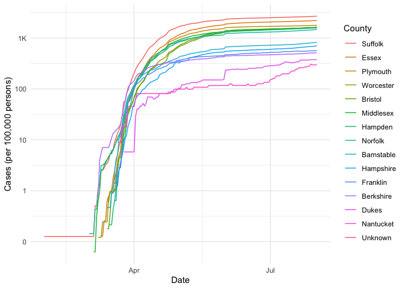

COVID-19
================
ingridmathilde
2020-07-27

  - [Grading Rubric](#grading-rubric)
      - [Individual](#individual)
      - [Team](#team)
      - [Due Date](#due-date)
  - [The Big Picture](#the-big-picture)
  - [Get the Data](#get-the-data)
      - [Navigating the Census Bureau](#navigating-the-census-bureau)
      - [Automated Download of NYT
        Data](#automated-download-of-nyt-data)
  - [Join the Data](#join-the-data)
  - [Analyze](#analyze)
      - [Normalize](#normalize)
      - [Guided EDA](#guided-eda)
      - [Self-directed EDA](#self-directed-eda)
          - [Ideas](#ideas)
          - [Aside: Some visualization
            tricks](#aside-some-visualization-tricks)
          - [Geographic exceptions](#geographic-exceptions)
  - [Notes](#notes)

*Purpose*: We can’t *possibly* do a class on data science and *not* look
at covid-19. Come on.

In this challenge, you’ll learn how to navigate the U.S. Census Bureau
website, programmatically download data from the internet, and perform a
county-level population-weighted analysis of current covid-19 trends.
Get excited\!

<!-- include-rubric -->

# Grading Rubric

<!-- -------------------------------------------------- -->

Unlike exercises, **challenges will be graded**. The following rubrics
define how you will be graded, both on an individual and team basis.

## Individual

<!-- ------------------------- -->

| Category    | Unsatisfactory                                                                   | Satisfactory                                                               |
| ----------- | -------------------------------------------------------------------------------- | -------------------------------------------------------------------------- |
| Effort      | Some task **q**’s left unattempted                                               | All task **q**’s attempted                                                 |
| Observed    | Did not document observations                                                    | Documented observations based on analysis                                  |
| Supported   | Some observations not supported by analysis                                      | All observations supported by analysis (table, graph, etc.)                |
| Code Styled | Violations of the [style guide](https://style.tidyverse.org/) hinder readability | Code sufficiently close to the [style guide](https://style.tidyverse.org/) |

## Team

<!-- ------------------------- -->

| Category   | Unsatisfactory                                                                                   | Satisfactory                                       |
| ---------- | ------------------------------------------------------------------------------------------------ | -------------------------------------------------- |
| Documented | No team contributions to Wiki                                                                    | Team contributed to Wiki                           |
| Referenced | No team references in Wiki                                                                       | At least one reference in Wiki to member report(s) |
| Relevant   | References unrelated to assertion, or difficult to find related analysis based on reference text | Reference text clearly points to relevant analysis |

## Due Date

<!-- ------------------------- -->

All the deliverables stated in the rubrics above are due on the day of
the class discussion of that exercise. See the
[Syllabus](https://docs.google.com/document/d/1jJTh2DH8nVJd2eyMMoyNGroReo0BKcJrz1eONi3rPSc/edit?usp=sharing)
for more information.

``` r
library(tidyverse)
```

    ## ── Attaching packages ────────────────────────────────────────────────────────────────────────────────────────────────────────────── tidyverse 1.3.0 ──

    ## ✓ ggplot2 3.3.2     ✓ purrr   0.3.4
    ## ✓ tibble  3.0.1     ✓ dplyr   1.0.0
    ## ✓ tidyr   1.1.0     ✓ stringr 1.4.0
    ## ✓ readr   1.3.1     ✓ forcats 0.5.0

    ## ── Conflicts ───────────────────────────────────────────────────────────────────────────────────────────────────────────────── tidyverse_conflicts() ──
    ## x dplyr::filter() masks stats::filter()
    ## x dplyr::lag()    masks stats::lag()

*Background*:
[COVID-19](https://en.wikipedia.org/wiki/Coronavirus_disease_2019) is
the disease caused by the virus SARS-CoV-2. In 2020 it became a global
pandemic, leading to huge loss of life and tremendous disruption to
society. The New York Times published up-to-date data on the progression
of the pandemic across the United States—we will study these data in
this challenge.

# The Big Picture

<!-- -------------------------------------------------- -->

We’re about to go through *a lot* of weird steps, so let’s first fix the
big picture firmly in mind:

We want to study COVID-19 in terms of data: both case counts (number of
infections) and deaths. We’re going to do a county-level analysis in
order to get a high-resolution view of the pandemic. Since US counties
can vary widely in terms of their population, we’ll need population
estimates in order to compute infection rates (think back to the
`Titanic` challenge).

That’s the high-level view; now let’s dig into the details.

# Get the Data

<!-- -------------------------------------------------- -->

1.  County-level population estimates (Census Bureau)
2.  County-level COVID-19 counts (New York Times)

## Navigating the Census Bureau

<!-- ------------------------- -->

**Steps**: Our objective is to find the 2018 American Community
Survey\[1\] (ACS) Total Population estimates, disaggregated by counties.
To check your results, this is Table `B01003`.

1.  Go to [data.census.gov](data.census.gov).
2.  Scroll down and click `View Tables`.
3.  Apply filters to find the ACS Total Population estimates,
    disaggregated by counties. I used the filters:

<!-- end list -->

  - `Topics > Populations and People > Counts, Estimates, and
    Projections > Population Total`
  - `Geography > County > All counties in United States`

<!-- end list -->

5.  Click the `Download` button to download the data; make sure to
    select the 2018 y-year estimates.
6.  Unzip and move the data to your `challenges/data` folder.

<!-- end list -->

  - Note that the data will have the crazy-long filename
    `ACSDT5Y2018.B01003_data_with_overlays_2020-06-30T102151.csv`.
    That’s because metadata is stored in the filename, such as the
    year of the estimate (`Y2018`) and my access date (`2020-06-30`).

**q1** Load Table `B01003` into the following tibble. Make sure the
column names are `id, Geographic Area Name, Estimate!!Total, Margin of
Error!!Total`.

*Hint*: You will need to use the `skip` keyword when loading these
data\!

``` r
## TASK: Load the census bureau data with the following tibble name.
df_pop <- read_csv("./data/ACSDT5Y2018.B01003_2020-07-28T161329/ACSDT5Y2018.B01003_data_with_overlays_2020-07-21T092815.csv", skip = 1)
```

    ## Parsed with column specification:
    ## cols(
    ##   id = col_character(),
    ##   `Geographic Area Name` = col_character(),
    ##   `Estimate!!Total` = col_double(),
    ##   `Margin of Error!!Total` = col_character()
    ## )

*Note*: You can find information on 1-year, 3-year, and 5-year estimates
[here](https://www.census.gov/programs-surveys/acs/guidance/estimates.html).
The punchline is that 5-year estimates are more reliable but less
current.

## Automated Download of NYT Data

<!-- ------------------------- -->

ACS 5-year estimates don’t change all that often, but the COVID-19 data
are changing rapidly. To that end, it would be nice to be able to
*programmatically* download the most recent data for analysis; that way
we can update our analysis whenever we want simply by re-running our
notebook. This next problem will have you set up such a pipeline.

The New York Times is publishing up-to-date data on COVID-19 on
[GitHub](https://github.com/nytimes/covid-19-data).

**q2** Visit the NYT [GitHub](https://github.com/nytimes/covid-19-data)
repo and find the URL for the **raw** US County-level data. Assign that
URL as a string to the variable below.

``` r
## TASK: Find the URL for the NYT covid-19 county-level data
url_counties <- "https://raw.githubusercontent.com/nytimes/covid-19-data/master/us-counties.csv"
```

Once you have the url, the following code will download a local copy of
the data, then load the data into R.

``` r
## NOTE: No need to change this; just execute
## Set the filename of the data to download
filename_nyt <- "./data/nyt_counties.csv"

## Download the data locally
curl::curl_download(
        url_counties,
        destfile = filename_nyt
      )

## Loads the downloaded csv
df_covid <- read_csv(filename_nyt)
```

    ## Parsed with column specification:
    ## cols(
    ##   date = col_date(format = ""),
    ##   county = col_character(),
    ##   state = col_character(),
    ##   fips = col_character(),
    ##   cases = col_double(),
    ##   deaths = col_double()
    ## )

You can now re-run the chunk above (or the entire notebook) to pull the
most recent version of the data. Thus you can periodically re-run this
notebook to check in on the pandemic as it evolves.

*Note*: You should feel free to copy-paste the code above for your own
future projects\!

# Join the Data

<!-- -------------------------------------------------- -->

To get a sense of our task, let’s take a glimpse at our two data
sources.

``` r
## NOTE: No need to change this; just execute
df_pop %>% glimpse
```

    ## Rows: 3,221
    ## Columns: 4
    ## $ id                       <chr> "0500000US01001", "0500000US01003", "0500000…
    ## $ `Geographic Area Name`   <chr> "Autauga County, Alabama", "Baldwin County, …
    ## $ `Estimate!!Total`        <dbl> 55200, 208107, 25782, 22527, 57645, 10352, 2…
    ## $ `Margin of Error!!Total` <chr> "*****", "*****", "*****", "*****", "*****",…

``` r
df_covid %>% glimpse
```

    ## Rows: 376,334
    ## Columns: 6
    ## $ date   <date> 2020-01-21, 2020-01-22, 2020-01-23, 2020-01-24, 2020-01-24, 2…
    ## $ county <chr> "Snohomish", "Snohomish", "Snohomish", "Cook", "Snohomish", "O…
    ## $ state  <chr> "Washington", "Washington", "Washington", "Illinois", "Washing…
    ## $ fips   <chr> "53061", "53061", "53061", "17031", "53061", "06059", "17031",…
    ## $ cases  <dbl> 1, 1, 1, 1, 1, 1, 1, 1, 1, 1, 1, 1, 1, 1, 1, 1, 1, 1, 1, 1, 1,…
    ## $ deaths <dbl> 0, 0, 0, 0, 0, 0, 0, 0, 0, 0, 0, 0, 0, 0, 0, 0, 0, 0, 0, 0, 0,…

To join these datasets, we’ll need to use [FIPS county
codes](https://en.wikipedia.org/wiki/FIPS_county_code).\[2\] The last
`5` digits of the `id` column in `df_pop` is the FIPS county code, while
the NYT data `df_covid` already contains the `fips`.

**q3** Process the `id` column of `df_pop` to create a `fips` column.

``` r
## TASK: Create a `fips` column by extracting the county code
df_q3 <- df_pop %>% 
  mutate(
  fips = str_sub(id, start = -5)
)

df_q3
```

    ## # A tibble: 3,221 x 5
    ##    id          `Geographic Area Nam… `Estimate!!Tota… `Margin of Error!!T… fips 
    ##    <chr>       <chr>                            <dbl> <chr>                <chr>
    ##  1 0500000US0… Autauga County, Alab…            55200 *****                01001
    ##  2 0500000US0… Baldwin County, Alab…           208107 *****                01003
    ##  3 0500000US0… Barbour County, Alab…            25782 *****                01005
    ##  4 0500000US0… Bibb County, Alabama             22527 *****                01007
    ##  5 0500000US0… Blount County, Alaba…            57645 *****                01009
    ##  6 0500000US0… Bullock County, Alab…            10352 *****                01011
    ##  7 0500000US0… Butler County, Alaba…            20025 *****                01013
    ##  8 0500000US0… Calhoun County, Alab…           115098 *****                01015
    ##  9 0500000US0… Chambers County, Ala…            33826 *****                01017
    ## 10 0500000US0… Cherokee County, Ala…            25853 *****                01019
    ## # … with 3,211 more rows

Use the following test to check your answer.

``` r
## NOTE: No need to change this
## Check known county
assertthat::assert_that(
              (df_q3 %>%
              filter(str_detect(`Geographic Area Name`, "Autauga County")) %>%
              pull(fips)) == "01001"
            )
```

    ## [1] TRUE

``` r
print("Very good!")
```

    ## [1] "Very good!"

Once

**q4** Join `df_covid` with `df_q3` by the `fips` column. Use the proper
type of join to preserve all rows in `df_covid`.

``` r
## TASK: Join df_covid and df_q3 by fips.
df_q4 <- df_covid %>% 
  left_join(df_q3, "fips")
```

For convenience, I down-select some columns and produce more convenient
column names.

``` r
## NOTE: No need to change; run this to produce a more convenient tibble
df_data <-
  df_q4 %>%
  select(
    date,
    county,
    state,
    fips,
    cases,
    deaths,
    population = `Estimate!!Total`
  )
```

# Analyze

<!-- -------------------------------------------------- -->

Now that we’ve done the hard work of loading and wrangling the data, we
can finally start our analysis. Our first step will be to produce county
population-normalized cases and death counts. Then we will explore the
data.

## Normalize

<!-- ------------------------- -->

**q5** Use the `population` estimates in `df_data` to normalize `cases`
and `deaths` to produce per 100,000 counts.\[3\] Store these values in
the columns `cases_perk` and `deaths_perk`.

``` r
## TASK: Normalize cases and deaths
df_normalized <-
  df_data %>% 
  mutate(cases_perk = cases/(population/100000), deaths_perk = deaths/(population/100000))
```

You may use the following test to check your work.

``` r
## NOTE: No need to change this
## Check known county data
assertthat::assert_that(
              abs(df_normalized %>%
               filter(
                 str_detect(county, "Snohomish"),
                 date == "2020-01-21"
               ) %>%
              pull(cases_perk) - 0.127) < 1e-3
            )
```

    ## [1] TRUE

``` r
assertthat::assert_that(
              abs(df_normalized %>%
               filter(
                 str_detect(county, "Snohomish"),
                 date == "2020-01-21"
               ) %>%
              pull(deaths_perk) - 0) < 1e-3
            )
```

    ## [1] TRUE

``` r
print("Excellent!")
```

    ## [1] "Excellent!"

## Guided EDA

<!-- ------------------------- -->

Before turning you loose, let’s complete a couple guided EDA tasks.

**q6** Compute the mean and standard deviation for `cases_perk` and
`deaths_perk`.

``` r
## TASK: Compute mean and sd for cases_perk and deaths_perk
df_normalized
```

    ## # A tibble: 376,334 x 9
    ##    date       county  state fips  cases deaths population cases_perk deaths_perk
    ##    <date>     <chr>   <chr> <chr> <dbl>  <dbl>      <dbl>      <dbl>       <dbl>
    ##  1 2020-01-21 Snohom… Wash… 53061     1      0     786620    0.127             0
    ##  2 2020-01-22 Snohom… Wash… 53061     1      0     786620    0.127             0
    ##  3 2020-01-23 Snohom… Wash… 53061     1      0     786620    0.127             0
    ##  4 2020-01-24 Cook    Illi… 17031     1      0    5223719    0.0191            0
    ##  5 2020-01-24 Snohom… Wash… 53061     1      0     786620    0.127             0
    ##  6 2020-01-25 Orange  Cali… 06059     1      0    3164182    0.0316            0
    ##  7 2020-01-25 Cook    Illi… 17031     1      0    5223719    0.0191            0
    ##  8 2020-01-25 Snohom… Wash… 53061     1      0     786620    0.127             0
    ##  9 2020-01-26 Marico… Ariz… 04013     1      0    4253913    0.0235            0
    ## 10 2020-01-26 Los An… Cali… 06037     1      0   10098052    0.00990           0
    ## # … with 376,324 more rows

``` r
df_q6 <- df_normalized %>% 
  summarise(
    cases_perk_mean = mean(cases_perk, na.rm = TRUE),
    cases_perk_sd = sd(cases_perk, na.rm = TRUE),
    deaths_perk_mean = mean(deaths_perk, na.rm = TRUE),
    deaths_perk_sd = sd(deaths_perk, na.rm = TRUE)
  )

df_q6
```

    ## # A tibble: 1 x 4
    ##   cases_perk_mean cases_perk_sd deaths_perk_mean deaths_perk_sd
    ##             <dbl>         <dbl>            <dbl>          <dbl>
    ## 1            346.          653.             11.4           26.4

**q7** Find the top 10 counties in terms of `cases_perk`, and the top 10
in terms of `deaths_perk`. Report the population of each county along
with the per-100,000 counts. Compare the counts against the mean values
you found in q6. Note any observations. Does New York City show up in
the top? Why or why not?

``` r
## TASK: Find the top 10 max cases_perk counties; report populations as well

df_q7_1 <- df_normalized %>%
  group_by(
    county,
    state,
    population
  ) %>% 
  summarise(
    cases_perk_mean = mean(cases_perk, na.rm = TRUE),
    cases_perk_sd = sd(cases_perk, na.rm = TRUE),
    deaths_perk_mean = mean(deaths_perk, na.rm = TRUE),
    deaths_perk_sd = sd(deaths_perk, na.rm = TRUE)
  ) %>%
  ungroup() %>% 
  arrange(desc(cases_perk_mean))
```

    ## `summarise()` regrouping output by 'county', 'state' (override with `.groups` argument)

``` r
df_q7_1
```

    ## # A tibble: 3,239 x 7
    ##    county state population cases_perk_mean cases_perk_sd deaths_perk_mean
    ##    <chr>  <chr>      <dbl>           <dbl>         <dbl>            <dbl>
    ##  1 Trous… Tenn…       9573          10915.         6689.            34.7 
    ##  2 Dakota Nebr…      20317           6891.         2963.           109.  
    ##  3 Lake   Tenn…       7526           6090.         3843.             0   
    ##  4 Nobles Minn…      21839           5803.         2622.            17.2 
    ##  5 Linco… Arka…      13695           5243.         3174.            45.6 
    ##  6 Buena… Iowa       20260           4255.         3836.            22.8 
    ##  7 Colfax Nebr…      10760           4155.         2578.            22.2 
    ##  8 Ford   Kans…      34484           3409.         2418.            13.5 
    ##  9 Bleds… Tenn…      14602           3311.         1705.             4.32
    ## 10 Seward Kans…      22692           3298.         1584.             5.98
    ## # … with 3,229 more rows, and 1 more variable: deaths_perk_sd <dbl>

``` r
## TASK: Find the top 10 deaths_perk counties; report populations as well
df_q7_2 <- df_normalized %>%
  group_by(
    county,
    state,
    population
  ) %>% 
  summarise(
    cases_perk_mean = mean(cases_perk, na.rm = TRUE),
    cases_perk_sd = sd(cases_perk, na.rm = TRUE),
    deaths_perk_mean = mean(deaths_perk, na.rm = TRUE),
    deaths_perk_sd = sd(deaths_perk, na.rm = TRUE)
  ) %>%
  ungroup() %>% 
  arrange(desc(deaths_perk_mean))
```

    ## `summarise()` regrouping output by 'county', 'state' (override with `.groups` argument)

``` r
df_q7_2
```

    ## # A tibble: 3,239 x 7
    ##    county state population cases_perk_mean cases_perk_sd deaths_perk_mean
    ##    <chr>  <chr>      <dbl>           <dbl>         <dbl>            <dbl>
    ##  1 Rando… Geor…       7087           2182.          942.             245.
    ##  2 Terre… Geor…       8859           2031.          836.             231.
    ##  3 Hanco… Geor…       8535           1800.          999.             217.
    ##  4 Early  Geor…      10348           2017.          886.             213.
    ##  5 Essex  New …     793555           1679.          861.             159.
    ##  6 St. J… Loui…      43446           1689.          791.             146.
    ##  7 Union  New …     553066           2082.         1124.             140.
    ##  8 Nassau New …    1356564           2233.         1142.             135.
    ##  9 Passa… New …     504041           2297.         1298.             133.
    ## 10 Mitch… Geor…      22432           1541.          678.             130.
    ## # … with 3,229 more rows, and 1 more variable: deaths_perk_sd <dbl>

**Observations**:

  - Note your observations here\!

## Self-directed EDA

<!-- ------------------------- -->

**q8** Drive your own ship: You’ve just put together a very rich
dataset; you now get to explore\! Pick your own direction and generate
at least one punchline figure to document an interesting finding. I give
a couple tips & ideas below:

### Ideas

<!-- ------------------------- -->

  - Look for outliers.
  - Try web searching for news stories in some of the outlier counties.
  - Investigate relationships between county population and counts.
  - Fix the *geographic exceptions* noted below to study New York City.
  - Your own idea\!

### Aside: Some visualization tricks

<!-- ------------------------- -->

These data get a little busy, so it’s helpful to know a few `ggplot`
tricks to help with the visualization. Here’s an example focused on
Massachusetts.

``` r
## NOTE: No need to change this; just an example
df_normalized %>%
  filter(state == "Massachusetts") %>%

  ggplot(
    aes(date, cases_perk, color = fct_reorder2(county, date, cases_perk))
  ) +
  geom_line() +
  scale_y_log10(labels = scales::label_number_si()) +
  scale_color_discrete(name = "County") +
  theme_minimal() +
  labs(
    x = "Date",
    y = "Cases (per 100,000 persons)"
  )
```

    ## Warning: Removed 134 row(s) containing missing values (geom_path).

<!-- -->

*Tricks*:

  - I use `fct_reorder2` to *re-order* the color labels such that the
    color in the legend on the right is ordered the same as the vertical
    order of rightmost points on the curves. This makes it easier to
    reference the legend.
  - I manually set the `name` of the color scale in order to avoid
    reporting the `fct_reorder2` call.
  - I use `scales::label_number_si` to make the vertical labels more
    readable.
  - I use `theme_minimal()` to clean up the theme a bit.
  - I use `labs()` to give manual labels.

### Geographic exceptions

<!-- ------------------------- -->

The NYT repo documents some [geographic
exceptions](https://github.com/nytimes/covid-19-data#geographic-exceptions);
the data for New York, Kings, Queens, Bronx and Richmond counties are
consolidated under “New York City” *without* a fips code. Thus the
normalized counts in `df_normalized` are `NA`. To fix this, you would
need to merge the population data from the New York City counties, and
manually normalize the data.

# Notes

<!-- -------------------------------------------------- -->

\[1\] The census used to have many, many questions, but the ACS was
created in 2010 to remove some questions and shorten the census. You can
learn more in [this wonderful visual
history](https://pudding.cool/2020/03/census-history/) of the census.

\[2\] FIPS stands for [Federal Information Processing
Standards](https://en.wikipedia.org/wiki/Federal_Information_Processing_Standards);
these are computer standards issued by NIST for things such as
government data.

\[3\] Demographers often report statistics not in percentages (per 100
people), but rather in per 100,000 persons. This is [not always the
case](https://stats.stackexchange.com/questions/12810/why-do-demographers-give-rates-per-100-000-people)
though\!
