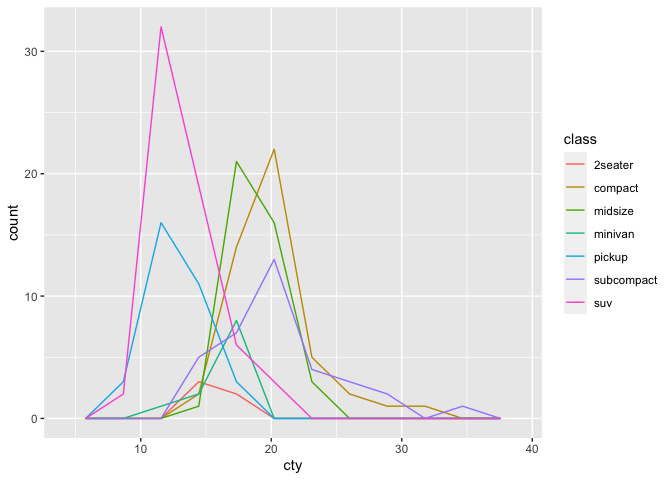
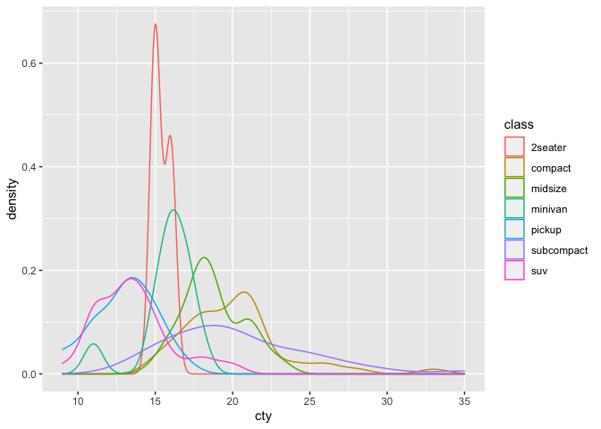
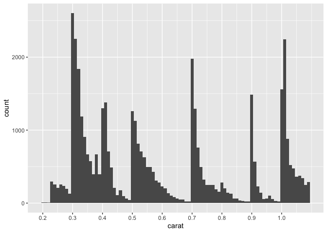

Visualization: Histograms
================
Zach del Rosario
2020-05-22

# Setup

*Purpose*: *Histograms* are a key tool for EDA. In this exercise we’ll
get a little more practice constructing and interpreting histograms and
densities.

*Reading*: [Histograms](https://rstudio.cloud/learn/primers/3.3)
*Topics*: (All topics) *Reading Time*: \~20 minutes

``` r
library(tidyverse)
```

    ## ── Attaching packages ───────────────────────────────────────────── tidyverse 1.3.0 ──

    ## ✓ ggplot2 3.3.2     ✓ purrr   0.3.4
    ## ✓ tibble  3.0.1     ✓ dplyr   1.0.0
    ## ✓ tidyr   1.1.0     ✓ stringr 1.4.0
    ## ✓ readr   1.3.1     ✓ forcats 0.5.0

    ## ── Conflicts ──────────────────────────────────────────────── tidyverse_conflicts() ──
    ## x dplyr::filter() masks stats::filter()
    ## x dplyr::lag()    masks stats::lag()

# Question 1

**q1** Using the graphs generated in the chunks `q1-vis1` and `q1-vis2`
below, answer:

  - Which `class` has the most vehicles?
  - Which `class` has the broadest distribution of `cty` values?
  - Which graph—`vis1` or `vis2`—best helps you answer each question?

<!-- end list -->

``` r
## NOTE: No need to modify
mpg %>%
  ggplot(aes(cty, color = class)) +
  geom_freqpoly(bins = 10)
```

<!-- -->

``` r
## NOTE: No need to modify
mpg %>%
  ggplot(aes(cty, color = class)) +
  geom_density()
```

<!-- -->

**Overall Observations:**

**Use freqploy if you wish to know which class is the most numerous
across cities. Use density if you wish to know which class spans the
most cities.**

  - **Vis1 Observations:**
      - **Based on this plot, it is difficult to quickly tell which
        class contains the most vehicles. As I look, it seems that it
        could be either SUVs or compact cars.**
      - **It seems that either compact or subcompact class cars contain
        the broadest distribution of cities.**
  - **Vis2 Observations:**
      - **I cannot tell from a density plot which class contains the
        most vehicles.**
      - **It is clear from this plot that subcompact class cars contain
        tehe broadest distribution of cities.**

In the previous exercise, we learned how to *facet* a graph. Let’s use
that part of the grammar of graphics to clean up the graph above.

**q2** Modify `q1-vis2` to use a `facet_wrap()` on the `class`. “Free”
the vertical axis with the `scales` keyword to allow for a different y
scale in each facet.

``` r
mpg %>%
  ggplot(aes(cty, color = class)) +
  geom_density()
```

<!-- -->

In the reading, we learned that the “most important thing” to keep in
mind with `geom_histogram()` and `geom_freqpoly()` is to *explore
different binwidths*. We’ll explore this idea in the next question.

**q3** Analyze the following graph; make sure to test different
binwidths. What patterns do you see? Which patterns remain as you change
the binwidth?

``` r
## TODO: Run this chunk; play with differnet bin widths
diamonds %>%
  filter(carat < 1.1) %>%

  ggplot(aes(carat)) +
  geom_histogram(binwidth = 0.01, boundary = 0.005) +
  scale_x_continuous(
    breaks = seq(0, 1, by = 0.1)

  )
```

<!-- -->

**Observations** - Write your observations here\!

<!-- include-exit-ticket -->

# Exit Ticket

<!-- -------------------------------------------------- -->

Once you have completed this exercise, make sure to fill out the **exit
ticket survey**, [linked
here](https://docs.google.com/forms/d/e/1FAIpQLSeuq2LFIwWcm05e8-JU84A3irdEL7JkXhMq5Xtoalib36LFHw/viewform?usp=pp_url&entry.693978880=e-vis02-histograms-assignment.Rmd).
