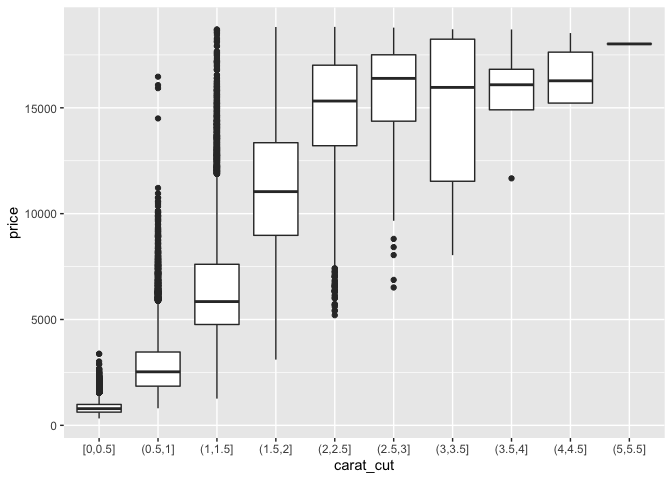
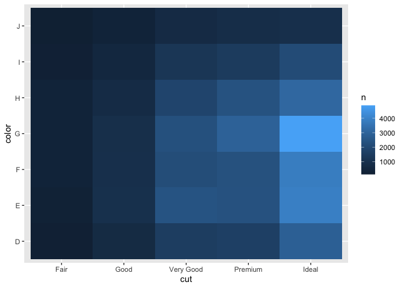
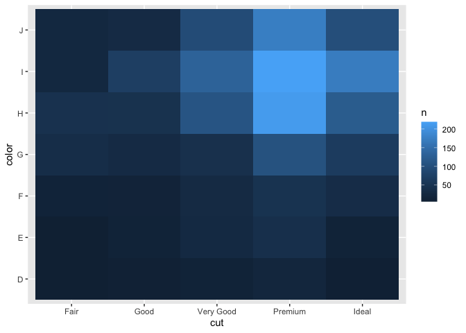
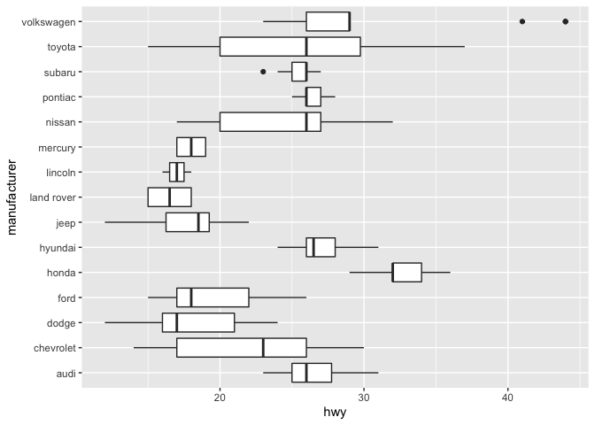

Visualization: Boxplots and Counts
================
Zach del Rosario
2020-06-04

*Purpose*: *Boxplots* are a key tool for EDA. Like histograms, boxplots
give us a sense of “shape” for a distribution. However, a boxplot is a
*careful summary* of shape. This helps us pick out key features of a
distribution, and enables easier comparison of different distributions.

*Reading*: [Boxplots and
Counts](https://rstudio.cloud/learn/primers/3.4) *Topics*: (All topics)
*Reading Time*: \~20 minutes

``` r
library(tidyverse)
```

    ## ── Attaching packages ────────────────────────────────────────────────────────── tidyverse 1.3.0 ──

    ## ✓ ggplot2 3.3.2     ✓ purrr   0.3.4
    ## ✓ tibble  3.0.1     ✓ dplyr   1.0.0
    ## ✓ tidyr   1.1.0     ✓ stringr 1.4.0
    ## ✓ readr   1.3.1     ✓ forcats 0.5.0

    ## ── Conflicts ───────────────────────────────────────────────────────────── tidyverse_conflicts() ──
    ## x dplyr::filter() masks stats::filter()
    ## x dplyr::lag()    masks stats::lag()

A *subtle point* from the primer is that we can use `dplyr` to generate
new facts about our data, then use `ggplot2` to visualize those facts.
We’ll practice this idea in a number of ways.

# Question 1

**q1** Use a `cut_*` verb to create a categorical variable out of
`carat`. Tweak the settings in your cut and document your observations.

*Hint*: Recall that we learned about `cut_interval, cut_number,
cut_width`. Take your pick\!

``` r
glimpse(diamonds)
```

    ## Rows: 53,940
    ## Columns: 10
    ## $ carat   <dbl> 0.23, 0.21, 0.23, 0.29, 0.31, 0.24, 0.24, 0.26, 0.22, 0.23, 0…
    ## $ cut     <ord> Ideal, Premium, Good, Premium, Good, Very Good, Very Good, Ve…
    ## $ color   <ord> E, E, E, I, J, J, I, H, E, H, J, J, F, J, E, E, I, J, J, J, I…
    ## $ clarity <ord> SI2, SI1, VS1, VS2, SI2, VVS2, VVS1, SI1, VS2, VS1, SI1, VS1,…
    ## $ depth   <dbl> 61.5, 59.8, 56.9, 62.4, 63.3, 62.8, 62.3, 61.9, 65.1, 59.4, 6…
    ## $ table   <dbl> 55, 61, 65, 58, 58, 57, 57, 55, 61, 61, 55, 56, 61, 54, 62, 5…
    ## $ price   <int> 326, 326, 327, 334, 335, 336, 336, 337, 337, 338, 339, 340, 3…
    ## $ x       <dbl> 3.95, 3.89, 4.05, 4.20, 4.34, 3.94, 3.95, 4.07, 3.87, 4.00, 4…
    ## $ y       <dbl> 3.98, 3.84, 4.07, 4.23, 4.35, 3.96, 3.98, 4.11, 3.78, 4.05, 4…
    ## $ z       <dbl> 2.43, 2.31, 2.31, 2.63, 2.75, 2.48, 2.47, 2.53, 2.49, 2.39, 2…

``` r
diamonds %>%
  ## TODO: Use mutate to add the column `carat_cut`
  mutate(carat_cut = cut_width(carat, width = 0.5, boundary = 0)) %>% 
  ggplot(aes(x = carat_cut, y = price)) +
  geom_boxplot()
```

<!-- -->

***Observations***

  - **Choose bins that are maningfully different (depends on the
    situation).**
  - **Lower carat diamonds tend to have more outliers.**
  - **The quartiles are more narrow near the edges - perhaps because
    there is less data there?**
  - **The median shows a roughly logarithmic pattern, as do the
    quantiles but not the range or outliers.**
  - **Big variability at 3-3.5 carats\* - sort of interesting.**

# Question 2

**q2** The following code visualizes the count of diamonds of *all*
carats according to their cut and color. Modify the code to consider
*only* diamonds with `carat >= 2`. Does the most common group of cut and
color change?

``` r
## NOTE: No need to modify; run and inspect
diamonds %>%
  count(cut, color) %>%
  ggplot(aes(cut, color, fill = n)) +
  geom_tile()
```

<!-- -->

Modify the following code:

``` r
## TODO: Modify the code below to consider only diamonds with carat >= 2
diamonds %>%
  filter(carat >= 2) %>% 
  count(cut, color) %>%
  ggplot(aes(cut, color, fill = n)) +
  geom_tile()
```

<!-- -->

***Observations***: **The most common group of cut and color changed
from Ideal-G to Premium-I.**

**q3** The following plot has overlapping x-axis labels. Use a verb from
the reading to `flip` the coordinates and improve readability.

``` r
mpg %>%
  ggplot(aes(manufacturer, hwy)) +
  geom_boxplot() +
  coord_flip()
```

<!-- -->

This is a simple—but important—trick to remember when visualizing data
with many categories.

<!-- include-exit-ticket -->

# Exit Ticket

<!-- -------------------------------------------------- -->

Once you have completed this exercise, make sure to fill out the **exit
ticket survey**, [linked
here](https://docs.google.com/forms/d/e/1FAIpQLSeuq2LFIwWcm05e8-JU84A3irdEL7JkXhMq5Xtoalib36LFHw/viewform?usp=pp_url&entry.693978880=e-vis03-boxplots-assignment.Rmd).
