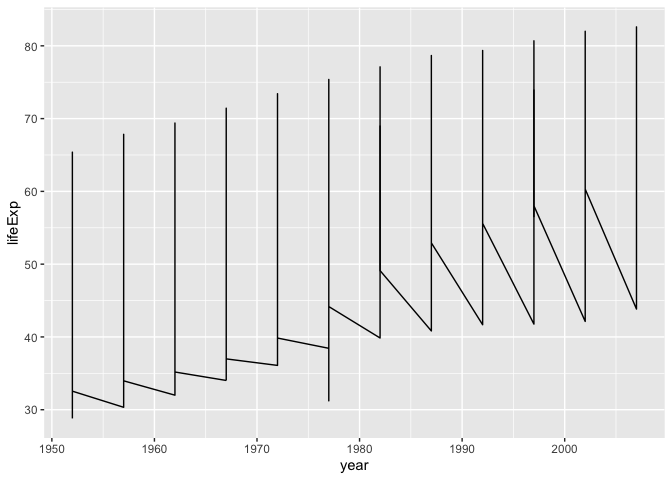
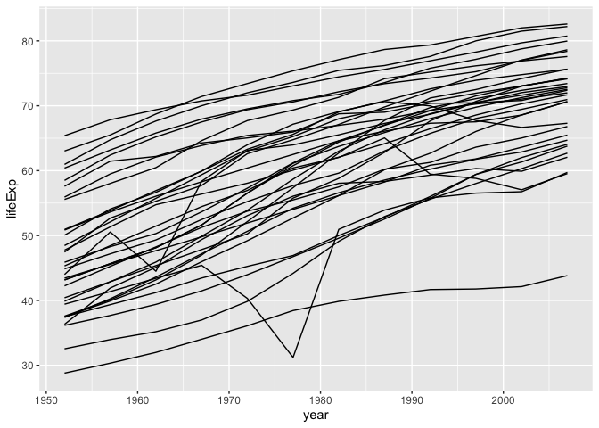
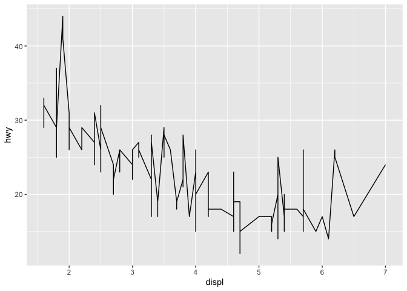
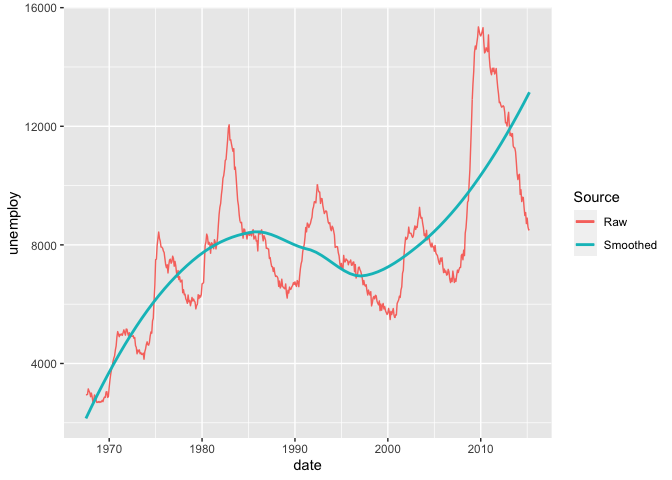

Visualization: Lines
================
Zach del Rosario
2020-06-04

*Purpose*: *Line plots* are a key tool for EDA. In contrast with a
scatterplot, a line plot assumes the data have a *function* relation.
This can create an issue if we try to plot data that do not satisfy our
assumptions. In this exercise, we’ll practice some best-practices for
constructing line plots.

*Reading*: [Boxplots and
Counts](https://rstudio.cloud/learn/primers/3.6) *Topics*: Welcome, Line
graphs, Similar geoms (skip Maps) *Reading Time*: \~30 minutes

``` r
library(tidyverse)
```

    ## ── Attaching packages ────────────────────────────────────────────────────────────────────────────────────────────────────────────── tidyverse 1.3.0 ──

    ## ✓ ggplot2 3.3.2     ✓ purrr   0.3.4
    ## ✓ tibble  3.0.1     ✓ dplyr   1.0.0
    ## ✓ tidyr   1.1.0     ✓ stringr 1.4.0
    ## ✓ readr   1.3.1     ✓ forcats 0.5.0

    ## ── Conflicts ───────────────────────────────────────────────────────────────────────────────────────────────────────────────── tidyverse_conflicts() ──
    ## x dplyr::filter() masks stats::filter()
    ## x dplyr::lag()    masks stats::lag()

``` r
library(gapminder)
```

**q1** The following graph doesn’t work as its author intended. Based on
what we learned in the reading, fix the following code.

``` r
## TODO: Fix the following code
old_code <- gapminder %>%
  filter(continent == "Asia") %>%
  ggplot(aes(year, lifeExp)) +
  geom_line()

new_code <- gapminder %>%
  filter(continent == "Asia") %>%
  ggplot(aes(year, lifeExp, group = country)) +
  geom_line()

old_code
```

<!-- -->

``` r
new_code
```

<!-- -->

**q2** A line plot makes *a certain assumption* about the underlying
data. What assumption is this? How does that assumption relate to the
following graph? Put differently, why is the use of `geom_line` a bad
idea for the following dataset?

``` r
## TODO: No need to edit; just answer the questions
mpg %>%
  ggplot(aes(displ, hwy)) +
  geom_line()
```

<!-- -->

``` r
mpg
```

    ## # A tibble: 234 x 11
    ##    manufacturer model    displ  year   cyl trans   drv     cty   hwy fl    class
    ##    <chr>        <chr>    <dbl> <int> <int> <chr>   <chr> <int> <int> <chr> <chr>
    ##  1 audi         a4         1.8  1999     4 auto(l… f        18    29 p     comp…
    ##  2 audi         a4         1.8  1999     4 manual… f        21    29 p     comp…
    ##  3 audi         a4         2    2008     4 manual… f        20    31 p     comp…
    ##  4 audi         a4         2    2008     4 auto(a… f        21    30 p     comp…
    ##  5 audi         a4         2.8  1999     6 auto(l… f        16    26 p     comp…
    ##  6 audi         a4         2.8  1999     6 manual… f        18    26 p     comp…
    ##  7 audi         a4         3.1  2008     6 auto(a… f        18    27 p     comp…
    ##  8 audi         a4 quat…   1.8  1999     4 manual… 4        18    26 p     comp…
    ##  9 audi         a4 quat…   1.8  1999     4 auto(l… 4        16    25 p     comp…
    ## 10 audi         a4 quat…   2    2008     4 manual… 4        20    28 p     comp…
    ## # … with 224 more rows

***Observations***:

  - **Geom\_line assumes that all data is within the same group/related
    along a continuous line of some sort.**
  - **mpg when comparing displ and hwy contains several subgroup that
    could be summarised but shouldn’t be like: class, manufacturer, or
    model.**

**q3** The following graph shows both the raw data and a smoothed
version. Describe the trends that you can see in the different curves.

``` r
## TODO: No need to edit; just interpret the graph
economics %>%
  ggplot(aes(date, unemploy)) +
  geom_line(aes(color = "Raw")) +
  geom_smooth(aes(color = "Smoothed"), se = FALSE) +
  scale_color_discrete(name = "Source")
```

    ## `geom_smooth()` using method = 'loess' and formula 'y ~ x'

<!-- -->

***Observations***:

  - **The Raw data demonstrates peaks and reactions in the number of
    unemployed people over time.**
  - **The Smoothed data erases this interesting peaks and dips. It
    mearly tells that the number of unemployed people increased from
    1970-1985, then dipped until increasing again in \~1997.**

<!-- include-exit-ticket -->

# Exit Ticket

<!-- -------------------------------------------------- -->

Once you have completed this exercise, make sure to fill out the **exit
ticket survey**, [linked
here](https://docs.google.com/forms/d/e/1FAIpQLSeuq2LFIwWcm05e8-JU84A3irdEL7JkXhMq5Xtoalib36LFHw/viewform?usp=pp_url&entry.693978880=e-vis05-lines-assignment.Rmd).
